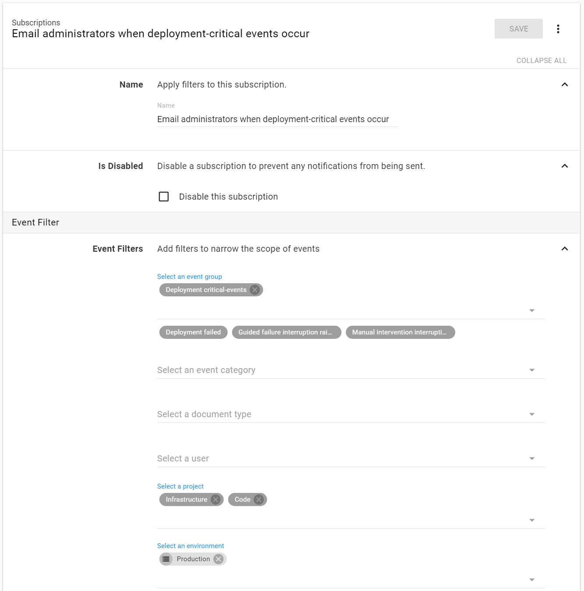
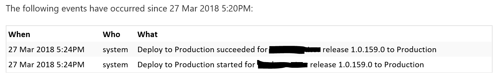
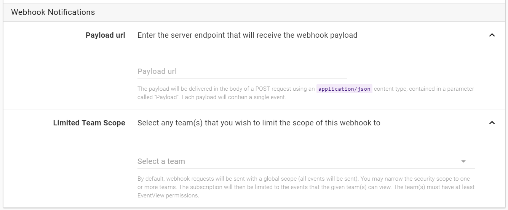
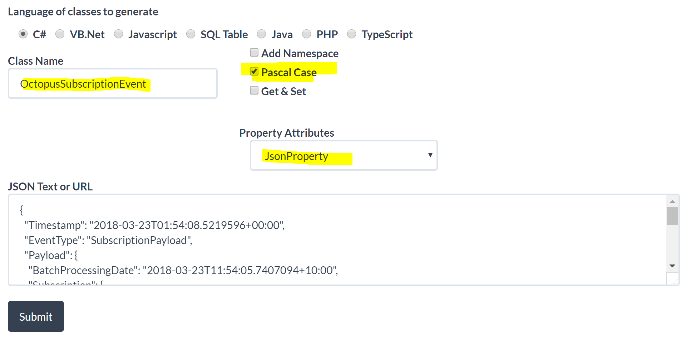
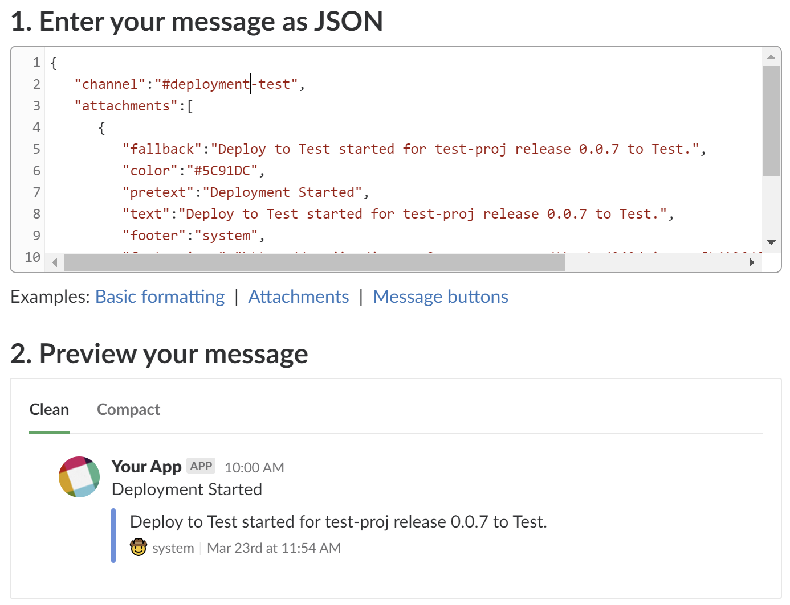

+++
title = 'Using an Azure function to get Octopus deployment notifications in Slack'
description = "If you want to be notified in Slack when an Octopus deployment occurs it's not just as simple as plugging in the Slack webhook url into Octopus. You need to use an intermediary that can translate the Octopus json format into the Slack json format. This post gives a high-level overview of how an Azure function can be used to do this."
summary = "If you want to be notified in Slack when an Octopus deployment occurs it's not just as simple as plugging in the Slack webhook url into Octopus. You need to use an intermediary that can translate the Octopus json format into the Slack json format. This post gives a high-level overview of how an Azure function can be used to do this."
#linkTitle = ''
keywords = ['octopus deploy', 'deployment', 'slack', 'azure', 'azure functions', 'dotnet']
date = 2018-03-29T00:00:00+10:00
draft = false
+++

# Introduction

Ideally deploying code into production should be trivial. By the time a release gets to this stage it should have gone through a variety of testing phases (_unit_, _integration_, _UAT_ etc). It will have also been promoted through a variety of environments that increasingly are more _production like_. The reality is that production deployments still require a bit of special attention from the team. Developers might monitor the logs more keenly after a production deployment or Team X may wish to be notified when Team Y deploys something for example. So keeping a team informed of deployments is an important part of the overall process.

I recently had a need to alert the team when a production deployment, of the many projects we care about, occurred. Slack is our messaging platform of choice so we wanted Octopus to drop a notification into our Slack channel when a new production deployment started, completed or failed.


## Octopus Subscriptions

Out of the box, Octopus has [subscriptions](https://octopus.com/docs/administration/subscriptions). A subscription allows you to define the scope of the alerts by picking which projects and events you wish to be alerted about. A subscription allows you to respond to these events in two ways: email or webhook.



## _Email_

Pretty straight forward. When an event occurs that's within your defined scope the nominated team members will receive an email containing the details of the events.


An example of the received email.



## _Webhook_

Email is useful but a Slack notification was what I was after so the webhook option sounded ideal. Slack supports webhook integrations out of the box, unfortunately though the json format of the Octopus subscription is not directly compatible with Slack so we need an intermediary that can accept the Octopus json, transform it and pass it off to the Slack webhook url.



### Zapier

The Octopus folks have [published an article](https://octopus.com/blog/subscriptions) on this subject. It involves using [Zapier](https://zapier.com/apps/integrations) as the intermediary to transform the json. I wasn't too keen on this solution. The Zapier free tier is limited to sending message at most every 15 minutes and the transform functionality was awkward too and I couldn't really get it to work how I wanted. In the end I decided I wanted more control over the process. I decided on an _Azure function_.

# Azure Function

I decided to write an Azure function that could be configured as the target of the Octopus subscription and would transform the json to the Slack format.

It's fairly simple, the basic flow is:

- Extract the json from the incoming request and de-serialize into an Octopus subscription object.
- Construct a slack message object and serialize to json.
- POST the json to the Slack webhook url.

## Incoming Octopus Message

To get an example of the Octopus json format, I used [http://webhook.site/](http://webhook.site/). This is a handy website gives you a unique url that you can use as test webhook endpoint. Anything you post to it will be captured and you can inspect the contents of the request body received. I configured my Octopus subscription to post to my webhook.site url and triggered a deployment of a test project. This is what I received...

### Octopus Json Payload

This is the Octopus subscription json format. Actually there was more to it than this but it was mostly extraneous information that I wasn't interested in. The json below is the parts that I wanted to use.

```json
{
"Timestamp": "2018-03-23T01:54:08.5219596+00:00",
"EventType": "SubscriptionPayload",
"Payload": {
"BatchProcessingDate": "2018-03-23T11:54:05.7407094+10:00",
"Subscription": {
"Name": "Notify Team of Deployments"
}
},
"Event": {
"Category": "DeploymentSucceeded",
"Username": "pmcilreavy",
"Occurred": "2018-03-23T00:42:01.0448185+00:00",
"Message": "Deploy to Dev succeeded for test-proj release 1.0.0.1 to Dev"
}
}
}
```

### Converting to C# objects

I was able to use [https://jsonutils.com/](https://jsonutils.com/) to convert the Octopus json into C# classes.



This gave me some nice C# classes ready to go, already annotated with with Newtonsoft JsonProperty attributes.

```csharp
public class Subscription
{

    [JsonProperty("Name")]
    public string Name { get; set; }

}

public class Payload
{

    [JsonProperty("BatchProcessingDate")]
    public DateTime BatchProcessingDate { get; set; }

    [JsonProperty("Subscription")]
    public Subscription Subscription { get; set; }

}

public class Event
{

    [JsonProperty("Category")]
    public string Category { get; set; }

    [JsonProperty("Username")]
    public string Username { get; set; }

    [JsonProperty("Occurred")]
    public DateTime Occurred { get; set; }

    [JsonProperty("Message")]
    public string Message { get; set; }

}

public class OctopusSubscriptionEvent
{

    [JsonProperty("Timestamp")]
    public DateTime Timestamp { get; set; }

    [JsonProperty("EventType")]
    public string EventType { get; set; }

    [JsonProperty("Payload")]
    public Payload Payload { get; set; }

    [JsonProperty("Event")]
    public Event Event { get; set; }

}
```

So far so good. I was able to grab the incoming json string from the request and de-serialize it to C# objects. Now to construct a Slack message payload.

## Outgoing Slack Message

Slack has a handy api tool called the [message builder](https://api.slack.com/docs/messages/builder) that allows you to experiment with the json and see how your message will look when it's delivered to a channel. Here is roughly what I ended up with.



### Converting to C# objects

Back again to [https://jsonutils.com/](https://jsonutils.com/) to convert the Slack json into C# classes.

```csharp
public class Attachment
{
[JsonProperty("fallback")]
public string Fallback { get; set; }

    [JsonProperty("color")]
    public string Color { get; set; }

    [JsonProperty("pretext")]
    public string Pretext { get; set; }

    [JsonProperty("text")]
    public string Text { get; set; }

    [JsonProperty("footer")]
    public string Footer { get; set; }

    [JsonProperty("footer_icon")]
    public string FooterIcon { get; set; }

    [JsonProperty("ts")]
    public int Ts { get; set; }

}

public class SlackPayload
{

    [JsonProperty("channel")]
    public string Channel { get; set; }

    [JsonProperty("attachments")]
    public IList<Attachment> Attachments { get; set; }

}
```

Sweet, so I'm able to build a Slack message from the Octopus object and all I need to do now is post it to the Slack WebHook Url.

### Slack WebHook

No need to explain this in great detail, but generally you can just go to [https://yourteamname.slack.com/apps/manage/custom-integrations](https://yourteamname.slack.com/apps/manage/custom-integrations) and from there you can create a new webhook integration. Out of this you'll get a unique webhook url that will accept the message json and create the notification in the specified channel.

Here is what my Slack notification ended up looking like...


## Security

You wouldn't want just anyone being able to post a message into your Slack channel if they found out your webhook url. It's ~~not exactly~~ definitely not foolproof, but I made at least some attempt to secure the Azure function endpoint. The Octopus subscription configuration screen allows you to specify a custom http header key/ value that will be sent with every request. So all I do is set a key called `SUBSCRIPTION_EVENT_TOKEN` to a know guid value that I then check for on the Azure function side. If they don't match then I reject the request.

# Code

I've deliberately not shown much (if any) of the actual Azure function code in this post. But I've made the code available on [GitHub](https://github.com/pmcilreavy/OctopusSubscriptionHandlerAzureFunction). It's a work in progress, so feel free to use it with the usual caution. So far I've only implemented my specific Slack message requirement although it would be pretty easy to plug in other implementations that sent a message to other systems.

[https://github.com/pmcilreavy/OctopusSubscriptionHandlerAzureFunction](https://github.com/pmcilreavy/OctopusSubscriptionHandlerAzureFunction)

# Alternatives

- There is an Octopus add-in which can post a message direct to a Slack channel but it's something you have to configure for every project as a step in the project deployment process. This wasn't feasible for me as we have hundreds of individual projects and I didn't want to have to modify them all.

- I believe Octopus Deploy is [talking about making Slack integration a first class citizen](https://github.com/OctopusDeploy/Issues/issues/3395) and may allow use directly from a subscription without the need for an intermediary so I'll keep a lookout for that. For now, my Azure function solution is working well for me.
