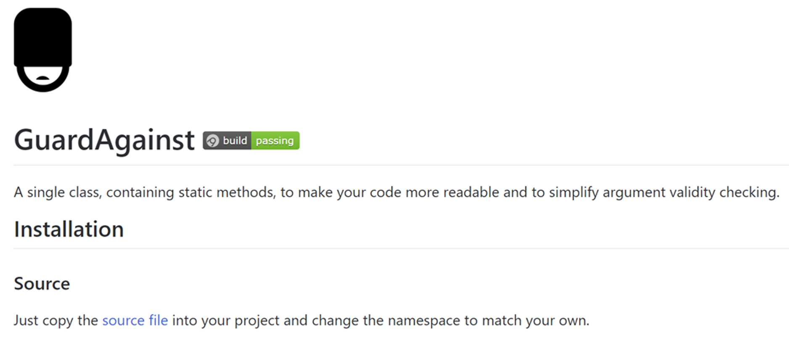

+++
title = 'The CallerArgumentExpression Attribute in C# 8.0'
description = "An exploration of how the new C# 8 CallerArgumentExpression attribute could enhance my open source 'GuardAgainst' library."
summary = "An exploration of how the new C# 8 CallerArgumentExpression attribute could enhance my open source 'GuardAgainst' library."
#linkTitle = ''
keywords = ['c#']
date = 2018-08-06T00:00:00+10:00
draft = false
+++

I like C#. I can remember downloading the first beta and playing with C# for the first time and thinking it was a lot like Java, which made it instantly familiar to me. C# 8.0 is due soon. We don't know when, Microsoft hasn't officially announced a date yet. But if we go by the release dates of the previous major versions we could expect C# 8.0 to drop sometime in 2019.

Microsoft now develops _all the things_ in the open and so detailed design specs for each of the proposed new features for C# 8.0 can be found on _[GitHub](https://github.com/dotnet/csharplang/tree/master/proposals)_. There are several often blogged about headline features such as: nullable reference types, async streams and _extension everything_. In this post though I want to focus on one of the more low key features, the [_**CallerArgumentExpression Attribute**_](https://github.com/dotnet/csharplang/blob/master/proposals/caller-argument-expression.md) and how it could greatly simplify one of my open source projects, _[GuardAgainst](https://github.com/pmcilreavy/GuardAgainst)_.

## GuardAgainst

So let me tell you about a small, unambitious project I have on GitHub called _[GuardAgainst](https://github.com/pmcilreavy/GuardAgainst)_. It's a library to make writing guard clauses for your methods trivial.



Methods are contracts. They accept arguments, do _stuff_ with them and potentially return a value. If a method cannot meet the contract based on the given arguments it should throw an appropriate exception.

Writing these _guard clauses_, that throw if arguments are not valid, is tedious work and introduces noise and clutter to the code. The goal of _GuardAgainst_ is to make writing these guard clauses concise and expressive. Consider the following simplistic example of a method that accepts two strings and concatenates them together.

```
private static string GetFullname(string firstname, string surname)
{
if (firstname is null)
{
throw new ArgumentNullException(nameof(firstname), "Firstname is required.");
}

    if (string.IsNullOrWhiteSpace(firstname))
    {
        throw new ArgumentException("Firstname is required.", nameof(firstname));
    }

    if (surname is null)
    {
        throw new ArgumentNullException(nameof(surname));
    }

    if (string.IsNullOrWhiteSpace(surname))
    {
        throw new ArgumentException("Surname is required.", nameof(surname));
    }

    return $"{firstname} {surname}";

}
```

First we check that each argument is not null. If it is we throw an `ArgumentNullException` exception. If not we then check that it's not just whitespace and if it is we throw an `ArgumentException`. This is because `ArgumentNullException` and `ArgumentException` convey different meanings and we want to be as precise as possible about why the argument does not meet the method contract. So we end up with four guard clauses. Two for each of our arguments. A developer reading this code has to mentally parse each clause and move on until they get to the actual meat of the method.

_GuardAgainst_ provides a bunch of methods to reduce this code into much neater calls that are named carefully to be very readable and clearly express their intent. So the code in the above example would become this...

```csharp
private static string GetFullname(string firstname, string surname)
{
GuardAgainst.ArgumentBeingNullOrWhitespace(firstname, nameof(firstname), "Firstname is required.");
GuardAgainst.ArgumentBeingNullOrWhitespace(surname, nameof(surname), "Surname is required.");

    return $"{firstname} {surname}";

}
```

There are many such libraries available but I felt the need to create another one as they often suffer from usability issues (bad naming, clunky methods), performance issues (reflection, boxing) or simply don't have the range of features to check the conditions I wanted to be able to guard against. I also designed it as a single file that could be dropped into a project so that consumers do not have to take a dependency on a dll or a nuget package.

Even though I've tried to keep the usage of this library as simple as possible. The new _CallerArgumentExpression_ could dramatically simplify things even further. Let's first look at how I implement a typical method in the library.

### How GuardAgainst currently works

Here is a _simplified_ example of what a typical guard method in the library looks like and how it's called.

```csharp
public static void ArgumentBeingNull<T>(T argumentValue,
string argumentName = default(string))
where T : class
{
if (argumentValue != null)
{
return;
}

    throw new ArgumentNullException(argumentName);

}
```

```csharp
GuardAgainst.ArgumentBeingNull(firstname, nameof(firstname));
```

In this example we are guarding against an argument being `null` so we pass the value that we want to check: `firstname`. If `argumentValue` isn't null then we just return. If it is null then we throw an `ArgumentNullException`. Pretty simple.

### The Problem

In order to make this useful we also need to pass in the _name_ of the argument to the constructor of the exception. If we have several parameters then having the name in the exception makes it obvious which parameter caused the fault. The problem is that there is no way to get this name unless the caller of the method passes it in for us.

I've never liked this. It's a clunky necessity that adds friction to the api. The ultimate goal is to be able to _know_ the name of argument being passed in without the developer having to actually pass it in via another argument.

### A Possible Approach

One possible way I could achieve this goal right now with current C# is by making `ArgumentBeingNull` accept an `Expression<Func<T>>` and have the caller pass in an expression that evaluates to the _thing_ to be checked for null. I'd also then be able to get the string representation of that argument too. Sounds good, let's have a look.

```csharp
public static void ArgumentBeingNull<T>(Expression<Func<T>> argumentExpression)
where T : class
{
var argumentValue = argumentExpression.Compile().Invoke();

    if (argumentValue != null)
    {
        return;
    }

    var expressionBody = argumentExpression.Body.ToString();
    var valueExpressionRegex = new Regex(@"(value\()(.*)(\).)", RegexOptions.CultureInvariant);
    var valueMatch = valueExpressionRegex.Match(expressionBody);
    var argumentValueString = valueMatch.Success ? expressionBody.Remove(valueMatch.Value) : expressionBody;

    throw new ArgumentNullException(null, $"'{argumentValueString}' was null!");

}
```

```csharp
GuardAgainst.ArgumentBeingNull(() => firstname);
```

I've not yet added this to the GuardAgainst library as there are a couple of things I'm not overly happy about. The first is performance. This is not a huge issue based on some crude tests but it's significant enough to give me pause.

The second and main reason I've not done this is I think forcing people to write an expression like `() => firstname` is just as weird and awkward as making them pass in the name of the argument. Clunky weirdness is what I'm trying to avoid.

> The ultimate goal is to be able to _know_ the name of argument being passed in without the developer having to actually pass it in via another argument.

### CallerArgumentExpression to the rescue

The new _CallerArgumentExpression_ attribute proposed for C# 8.0 would be a great solution to this problem. Now consider the following code which is identical to my initial `ArgumentBeingNull` example above except that I've added the _CallerArgumentExpression_ attribute to the `argumentName` parameter.

The compiler recognises the _CallerArgumentExpression_ attribute and uses the string passed to its constructor (i.e. `argumentValue`) to target that parameter and converts the incoming expression to a string which is assigned to the `argumentName` parameter.

```csharp
public static void ArgumentBeingNull<T>(T argumentValue,
[CallerArgumentExpression("argumentValue")]
string argumentName = default(string))
where T : class
{
if (argumentValue != null)
{
return;
}

    throw new ArgumentNullException(argumentName);

}
```

What a developer would write to call it ...

```csharp
GuardAgainst.ArgumentBeingNull(firstname);
```

What the compiler effectively emits...

```csharp
GuardAgainst.ArgumentBeingNull(firstname, "firstname");
```

> "Allows developers to capture the expressions passed to a method, to enable better error messages in diagnostic/testing APIs and reduce keystrokes."

The _CallerArgumentExpression_ attribute is effectively giving me the `Expression<Func<T>>` solution I was toying with but without the performance overhead and without the clunky `() => firstname` syntax.

Not only would this be a super easy code change for me to implement, I would just need to add the _CallerArgumentExpression_ attribute and I'm done. It would also mean that callers of the library would just pass in the value of the argument they wish to guard against being null as they've always done but they would no longer have to explicitly specify the name. Ultimate goal achieved!
