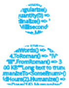
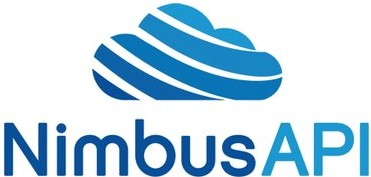
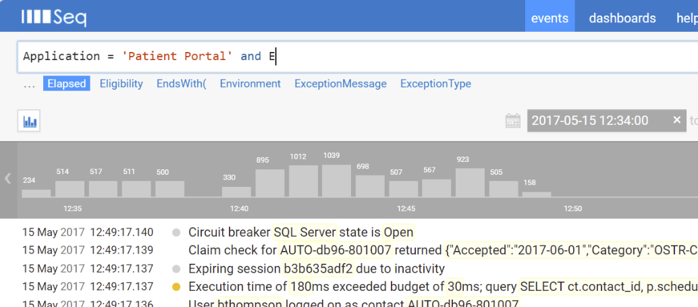

+++
title = 'Readify Consultant Toolbelt'
summary = 'Explore a treasure trove of indispensable libraries and tools createed by and used Readify consultants. From the simplicity of Autofac for IoC containers to the comprehensive deployment solutions of Octopus Deploy, and the structured logging prowess of Serilog, this curated collection showcases the best in .NET development tools. Enhance your coding toolkit with these Readify-developed resources, designed to streamline your software development process and boost productivity.'
tags = [
    "Readify",
    "Software Development",
    ".NET Libraries",
    "Coding Tools",
    "Development Best Practices"
]
keywords = [
    "Readify software tools",
    "Readify libraries C#",
    "Autofac IoC container",
    "Conventional library for .NET",
    "DbUp database deployment",
    "EnumGenie TypeScript generator",
    "GuardAgainst C# library",
    "Humanizer .NET library",
    "Nimbus Azure Service Bus",
    "Octopus Deploy automation",
    "Serilog structured logging",
    "Seq log analysis",
    "System.IO.Abstractions testing",
    ".NET development tools",
    "Software development best practices"
]
categories = ['software']
date = 2018-09-12
draft = false
aliases = ['/articles/2018-09/readify-consultant-toolbelt']
+++

**tl;dr** _A curated collection of ubiquitous libraries and tools that were created by current or ex-Readify employees._

I moved to Brisbane 2012 and I've worked at [Readify](https://readify.net/) since 2017. Readify developers past and present have a long history of producing popular libraries and tools, several of which you may already using. Before joining Readify I was aware of a few of them, like Octopus and Serilog. Others were new to me, and over the last year I've had fun learning about and using these tools that are fixture of a Readify consultants toolbelt 🛠.


The purpose of this post is just to pull to together a few of these tools, particularly the ones I've been using myself. So here they are in alphabetical order.

## Autofac

[https://github.com/autofac/Autofac](https://github.com/autofac/Autofac)

Inversion of control (IoC) is the idea that objects should not need to create the objects on which they rely. The dependencies should be provided by another external service. _Autofac_ is an IoC container for .NET applications. An IoC container is an essential part of modern software development and helps us produce _SOLID_ code, reduces coupling between components and increases the their testability.


> "Autofac" is a 1955 science fiction short story by American writer Philip K. Dick that features one of the earliest treatments of self-replicating machines. It is set some years after an apocalyptic world war has devastated Earth's civilizations, leaving only a network of hardened robot "autofacs" in operation to **supply goods** to the human survivors. Once humanity has recovered enough to want to begin reconstruction, the autofacs are immediately **targeted for shutdown** since they monopolize the planet's **resources**. _[Wikipedia](https://en.wikipedia.org/wiki/Autofac)_.

## ConfigInjector

[https://github.com/ConfigInjectorContributors/ConfigInjector](https://github.com/ConfigInjectorContributors/ConfigInjector)

Settings can be a pain. Adding a new value in a \*.config file is easy enough. The challenge is supplying that value to where it's needed (i.e. injecting it into one of your classes). It can be tricky to do that whilst keeping a clean separation of concerns. You don't want to have to mess up your lovely clean code with a bunch of calls to the `ConfigurationManager`.

> "A simple way to inject strongly-typed configuration settings into your application via [web;app].config."

This is where _ConfigInjector_ comes in handy. It plugs into your _IoC_ container of choice (_Hint_: use Autofac 😉) and provides a simple way to inject strongly-typed settings that you can define in your config files.

## Conventional

[https://github.com/andrewabest/Conventional](https://github.com/andrewabest/Conventional)

Writing tests can be laborious and time is often short so you need to focus on writing tests that provide the most value. You don't want to have to spend a lot of time writing, duplicating and maintaining tests that check for cross cutting concerns across your code base. There are many patterns in code that can lead to bugs or performance and testing issues. You want to prevent these from creeping into your code.


Conventional provides a way to test for many _code smells_ and enforce desirable conventions out of the box.

> "Conventional provides a suite of ready-made tests for enforcing conventions within your types, assemblies, solutions and databases to make sure your duckies are all in a row."

## DbUp

[https://github.com/dbup/dbup](https://github.com/dbup/dbup)

Retrieving code from a VCS and deploying it is relatively easy these days. Keeping a logical history of database schema changes and deploying them can still be tricky though. DbUp exists to solve this problem. You simply create each schema change as a stand alone SQL script and DbUp manages the execution and deployment of them to your various environments.


> DbUp is a .NET library that helps you to deploy changes to SQL Server databases. It tracks which SQL scripts have been run already, and runs the change scripts that are needed to get your database up to date.

## EnumGenie

[https://github.com/xwipeoutx/EnumGenie](https://github.com/xwipeoutx/EnumGenie)

A simple way to generate the typescript equivalents of your C# enums. Nuff said.

## GuardAgainst

[https://github.com/pm7y/GuardAgainst](https://github.com/pm7y/GuardAgainst)

It's a library of static guard clauses that allow you to check that an argument passes a given validity check and if it doesn't then throw an appropriate exception. For instance, you can check if a parameter is null and throw an ArgumentNullException. Or check that a comparable parameter (e.g. a date or number) is within a specified range and throw an ArgumentOutOfRangeException if it's not. There are many other variations.


```csharp
private static string GetFullname(string firstname, string surname)
{
    GuardAgainst.ArgumentBeingNullOrWhitespace(() => firstname, "Firstname is required.");
    GuardAgainst.ArgumentBeingNullOrWhitespace(() => surname, "Surname is required.");

    return $"{firstname} {surname}";
}
```

> Static methods that simplify argument validity checking and make your code more readable.

## Humanizer

[https://github.com/Humanizr/Humanizer](https://github.com/Humanizr/Humanizer)

Humanizer is a feature rich library that is all about making things more readable by humans. Like a `DateTime` for instance...

```csharp
DateTimeOffset.UtcNow.AddHours(1).Humanize() would become "an hour from now"
```



> Humanizer meets all your .NET needs for manipulating and displaying strings, enums, dates, times, timespans, numbers and quantities. It is part of the .NET Foundation, and operates under their code of conduct.

## Nimbus

[https://github.com/NimbusAPI/Nimbus](https://github.com/NimbusAPI/Nimbus)

Nimbus is similar to MassTransit or NServiceBus. It provides an abstraction over (primarily) Azure Service Bus and makes raising and handling messages trivial. Nimbus provides implementations of all of the common messaging patterns for building distributed, service-oriented systems. Designed to be lightweight and pluggable, it allows you to bring your choice of IoC container, logging framework, and serialization format.



> Nimbus is a .NET client library to add an easy to develop against experience against the Azure Service Bus.

It's starting to fall out of favour for greenfield projects since it's not actively developed as much as it once was but it's still very much in use in the wild.

## Octopus Deploy

[https://octopus.com/](https://octopus.com/)

Started by Paul Stovell in his spare time in 2011 because he was frustrated by the state of automated deployment for .NET developers. Octopus Deploy has gone on to become the de facto solution for doing automated deployments of .NET solutions and is used by over twenty thousand customers around the world. Hopefully you're using this already.


> Octopus Deploy is the most popular deployment automation server in the world. Over 20,000 companies use Octopus to automate .NET, Java and other application deployments to their servers.

## Serilog + Seq

[https://github.com/serilog/serilog](https://github.com/serilog/serilog)

[https://getseq.net/](https://getseq.net/)

Logging libraries such as Log4Net typically write unstructured lines of text into a log file or console. Serilog also provides diagnostic logging to files, the console, and many other outputs. Unlike other logging libraries though, Serilog is built from the ground up to record _structured_ event data.


> Serilog is a diagnostic logging library for .NET applications. It is easy to set up, has a clean API, and runs on all recent .NET platforms. While it's useful even in the simplest applications, Serilog's support for structured logging shines when instrumenting complex, distributed, and asynchronous applications and systems.

Parameters passed along with log messages are not destructively rendered into a text format. Instead, they're preserved as structured data, that can be written to a data store. Back-ends that are capable of recording structured event data make log searches and analysis possible without log parsing or regular expressions. That's where Seq comes in.

Seq is a centralised log sink for Serilog log events that understands structured log data and provides a nice UI that allows you to view the log data and perform complex queries over it.



> _Seq is the easiest way for development teams to capture, search and visualize structured log events._

## System.IO.Abstractions

[https://github.com/System-IO-Abstractions/System.IO.Abstractions](https://github.com/System-IO-Abstractions/System.IO.Abstractions)

Testing stuff can be hard. Especially IO related stuff. System.IO.Abstractions provides an IFileSystem interface which can be used in place of concrete types to make your objects, that require file IO access, more easily testable.

> Just like System.Web.Abstractions, but for System.IO. Yay for testable IO access!

At the core of the library is IFileSystem and FileSystem. Instead of calling methods like File.ReadAllText directly, use IFileSystem.File.ReadAllText. System.IO.Abstractions has exactly the same API, except that it's injectable and testable.

## Assorted Others

I'm listing these ones separately here simply because I haven't used them enough to have an opinion on them and from what I've seen they aren't as commonly used within Readify projects or the wider community. Probably because they are a bit more niche than the others.

- [BDDfy](https://github.com/TestStack/TestStack.BDDfy) _"BDDfy is the simplest BDD framework EVER!"_. If
  Behavior-driven development is your thing then this might be the framework for you.
- [SignalR](http://signalr.net/) _SignalR_ is a library for ASP.NET developers that makes it incredibly simple to add real-time web functionality to your applications.
- [Sprache](https://github.com/sprache/Sprache) _Sprache_ is a simple, lightweight library for constructing parsers directly in C# code.
- [Tailor](https://github.com/andrewabest/Tailor) A set of convention tests to make sure your Dapper queries adhere to certain good practices.

_Toolbelt image by R Diepenheim from the Noun Project._
