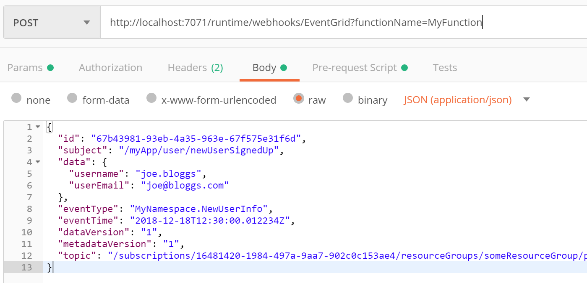
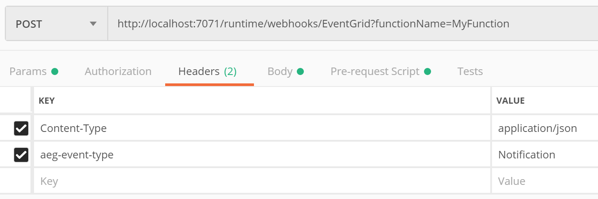
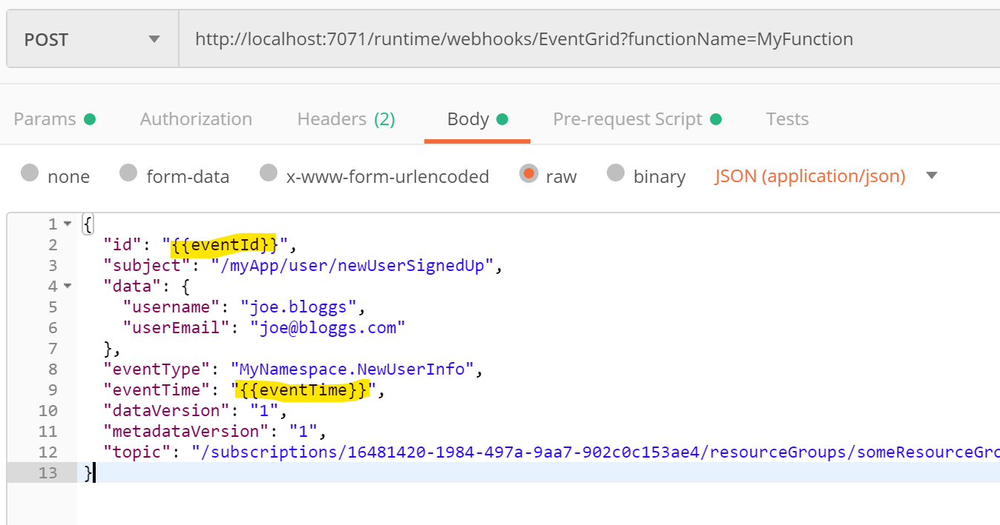

+++
title = 'Locally Debugging an Event Grid Triggered Azure Function with Postman'
description = 'How to use Postman to locally debug an Azure Function that has an Event Grid Trigger.'
summary = 'How to use Postman to locally debug an Azure Function that has an Event Grid Trigger.'
#linkTitle = ''
keywords = ['c#', 'azure event grid', 'azure function', 'serverless']
date = 2018-02-18T00:00:00+10:00
draft = false
+++

**tl;dr** _Just like you'd expect but the trick is to add this header (which took me a long time to track down in the docs): `aeg-event-type` = `Notification`_

Azure Functions can be invoked in response to various different [trigger](https://docs.microsoft.com/en-us/azure/azure-functions/functions-triggers-bindings) types. In this post we'll look at how to locally debug an Azure Function that is configured with an [Event Grid trigger](https://docs.microsoft.com/en-us/azure/azure-functions/functions-bindings-event-grid).

[Azure Event Grid](https://azure.microsoft.com/en-au/services/event-grid/) is analogous to SNS (Simple Notification Service) in AWS. It offers a simple event system which operates on a push-push model (rather than push-pull). Event Grid uses [topics](https://docs.microsoft.com/en-us/azure/event-grid/concepts). Events are published to a topic and subscribers receive the events from the topic. This model facilitates reactive programming and works great with Azure Logic apps and Azure Functions.

Event Grid is deeply integrated into Azure. Many of Azure's services can publish events to an Event Grid topic. For example, a blob storage container can publish an event whenever an image is uploaded. An Azure Function could then subscribe to this event and be used to resize and compress the image.

Anyway, since an Event Grid topic is not something that can be run locally, it can make debugging the Azure Function that subscribes to a topic a bit challenging at times. First let's quickly look at the structure of an event.

## Structure of an Event Grid Event

Event Grid has support for two event schemas: [Event Grid Schema](https://docs.microsoft.com/en-us/azure/event-grid/event-schema) and the [Cloud Event Schema](https://docs.microsoft.com/en-us/azure/event-grid/cloudevents-schema). For the purposes of this post we'll focus on the Event Grid Schema although the idea is exactly the same for both.

An event contains some metadata and a data object. This data object can be anything the publisher wishes to publish.

```json
{
    "topic": string,
    "subject": string,
    "id": string,
    "eventType": string,
    "eventTime": string,
    "data":{
      object-unique-to-each-publisher
    },
    "dataVersion": string,
    "metadataVersion": string
 }
```

We can imagine that if we have a web app we might want to publish an event when a new user signs up. Here's an example of what an event might look like for this. This will obviously vary depending on your own use-case.

```json
{
  "id": "c03d293c-bf9b-439e-ba53-13e8435d96ef",
  "subject": "/myApp/user/newUserSignedUp",
  "data": {
    "username": "joe.bloggs",
    "userEmail": "joe@bloggs.com"
  },
  "eventType": "MyNamespace.NewUserInfo",
  "eventTime": "2018-12-17T09:24:15.6676522Z",
  "dataVersion": "1",
  "metadataVersion": "1",
  "topic": "/subscriptions/16481420-1984-497a-9aa7-902c0c153ae4/resourceGroups/someResourceGroup/providers/Microsoft.EventGrid/topics/newUserSignupTopic"
}
```

## Debugging with Postman

[Postman](https://www.getpostman.com/) is a well-known application that can be used for testing api endpoints and is great for constructing json and POSTing it to an endpoint. We can use postman to test an Event Grid triggered Azure Function as follows: -

Firstly, grab the url of the function you are trying to test. It usually takes the following form:

`http://localhost:7071/runtime/webhooks/EventGrid?functionName=nameOfYourFunction`

We can plug this in to a new postman message, as shown in the screen-shot below. Be sure and specify POST as the verb. Also, paste in the event you wish to send in the body tab (under raw).



Then we need to switch to the Headers tab and add 3 headers:

- `Content-Type` = `application/json`
- `aeg-event-type` = `Notification`



That is it! Now set a breakpoint on your Azure Function solution and hit F5. Then send the Postman message and your breakpoint should be hit. When the Azure function completes it should return a 202 (Accepted) response back to Postman.

Depending on what you're testing, it's likely that you'll want to supply a new value for `id` and `eventTime` each time you send the message. It gets a bit tedious doing this by hand each time so you can utilise postman's _pre-request script_ feature to set a couple of variables that we can substitute in the body of the message.


The `id` and `eventTime` can be substituted as follows.



## An Alternative Method Using NGrok

Sometimes it's desirable to test using events coming directly from an Event Grid topic. Microsoft has documented a way of doing this with ngrok (a third party service) which acts as an intermediary. This can be used to subscribe to an Event Grid topic and relay the event down to your localhost. You should be aware that there may be privacy concerns with this approach as your data will be passing through a middleman.

[https://docs.microsoft.com/en-us/azure/azure-functions/functions-debug-event-grid-trigger-local](https://docs.microsoft.com/en-us/azure/azure-functions/functions-debug-event-grid-trigger-local)

Thanks for reading.
