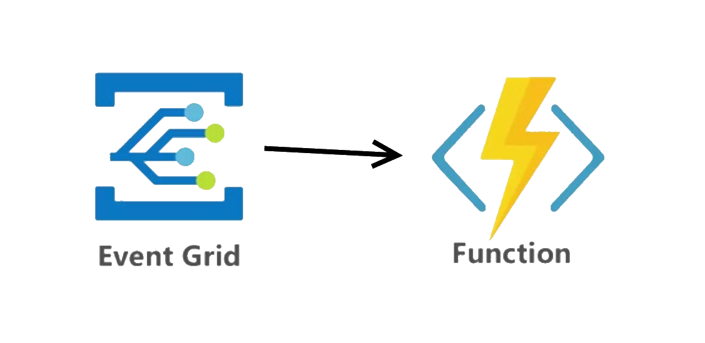

+++
title = 'Creating an Azure Event Grid Simulator'
summary = 'Dive into the creation of an Azure Event Grid Simulator, a revolutionary tool designed to streamline local integration testing for Azure-based applications. This comprehensive guide offers insights into setting up and utilizing the simulator, ensuring seamless pub-sub mechanism testing without needing an actual Azure Event Grid. Ideal for developers looking to enhance their workflow with efficient, offline event handling and debugging. Discover how to configure topics, subscribe to events with webhooks, and authenticate securely, all within your local development environment.'
tags = [
    "Event Grid",
    "Local Testing",
    "Simulation",
    "Azure Functions",
    "Pub-Sub"
]
keywords = [
    "Azure Event Grid Simulator",
    "Local integration testing Azure",
    "Azure pub-sub mechanism",
    "Azure services event publishing",
    "Event Grid topic configuration",
    "Azure Event Grid local testing",
    "Event Grid webhook subscription",
    "Simulating Azure Event Grid",
    "Azure function Event Grid trigger",
    "Event Grid simulator GitHub",
    "Azure Event Grid development",
    "Publish subscribe Azure",
    "Azure reactive programming",
    "Event Grid simulator setup",
    "Azure Event Grid security authentication"
]
categories = ['development']
date = 2019-02-05
draft = false
aliases = ['/articles/2019-02/creating-an-eventgrid-simulator']
+++

> _**tl;dr**_ Some notes creating an Azure Event Grid Simulator in order to make local integration testing a whole lot easier. It's on GitHub @ [https://github.com/pm7y/AzureEventGridSimulator](https://github.com/pm7y/AzureEventGridSimulator)

## What is Azure Event Grid?

Azure Event Grid is a simple pub-sub mechanism that is deeply baked into many Azure services. It facilitates reactive programming allowing Azure services (and your own app) to publish and subscribe to events and execute code when they are received. Within Event Grid you create one or more 'topics'. A topic provides an https endpoint to which events are published and subscribers subscribe to. Events are simple json messages that represent something that has happened in the past. For instace, you might publish an event when a new user has signed up to your awesome website.

In a typical pub-sub model the subscriber polls for new events and 'pulls' the ones it's interested in. The Azure Event Grid model is push/ push. So when a new event is published, the Event Grid topic 'pushes' the event to all of its subscribers.

There are several types of supported subscribers, the most common being a webhook. It's common to use an Azure Function as a subscriber to a topic.



## Why a simulator?

I recently used Azure Event Grid to facilite communication between disparate applications. One application would be publishing events and another would need to consume them from a database.

At a high level the publishing application would send events to an Event Grid topic. The topic has an Azure function subscriber which processes the message and inserts the details into an SQL database which the second application can then consume.

Azure functions can be tested and run locally (as can several other Azure services: Cosmos Db, Storage) and obviously SQL server can run locally but there is no way to run Azure Event Grid locally. What I wanted to be able to do was run the entire solution _offline_. In other words, publish an event to a local Event Grid topic and have that push the event to my locally running Azure function subscriber which in turn would insert that into my locally running SQL server.

## Existing Options

I looked into a couple of existing open source projects such as [github.com/Azure/eventgrid-emulator](https://github.com/Azure/eventgrid-emulator) and [github.com/ravinsp/eventgrid-emulator](https://github.com/ravinsp/eventgrid-emulator) but I quickly ruled them out for a few reasons:

### [github.com/Azure/eventgrid-emulator](https://github.com/Azure/eventgrid-emulator)

This one seems to be in Microsoft's Azure repo so I initially had high hopes that this was the _official_ solution. It's written in _Go_ which I only have limited knowledge of. I made stab at trying to compile it but pretty quickly gave up. There's no documenation and seemed like it wasn't actively being developed.

### [github.com/ravinsp/eventgrid-emulator](https://github.com/ravinsp/eventgrid-emulator)

I'm a bit fuzzy on the distinction between _simulate_ and _emulate_. But in my mind to _emulate_ something is **stronger** that _simulate_. A simulation is a best approximation. A Nintendo _emulator_ would need to exactly replicate the hardware platform if it had any hope of running the orginal game code. So when I found this Event Grid **Emulator** project it seemed like what I was looking for. It does work well for simpleer use cases, like if you only intend to test over _http_ and not _https_ and you are using your own custom code to post your events to a topic. However, Azure Event Grid only supports connections over https and the 'official' Azure Event Grid client is in a nuget package called `Microsoft.EventGrid.Client` and it only sends events over https. So an _emulator_ that doesn't support _https_ didn't seem like the right choice.

So I decided it would be a fun project to create my own.

## Goals for v1

### Topics

My _simulator_ would need to support the creation of multiple topics and each topic would need to support multiple subscribers. The topic endpoint should follow that of a _real_ one. i.e. support https and be in the form _https://topic-name.localhost:port/api/events._

### Subscribers

In my case I only needed to support one type of subscriber: an Azure function (i.e. webhook). Initially, this is all the simulator will support.

A topic can have 0 to _n_ subscribers. When a request is received for a topic, the events will be forwarded to each of the subscribers with the addition of an `aeg-event-type: Notification` header. If the message contains multiple events, they will be sent to each subscriber one at a time inline with the Azure Event Grid behaviour. _"Event Grid sends the events to subscribers in an array that has a single event. This behavior may change in the future."_

### Https

As we've already discussed, Azure Event Grid only supports https connections and so I decided that if I was going to create a simultor, that it should support https and therefore be compatible with the https-only `Microsoft.EventGrid.Client` nuget package. The simulator uses the dotnet development certificate to secure each topic port. You can ensure that this certifcate is installed by running the following command.

`dotnet dev-certs https`

### Keys

A topic is secured by a 'key'. In order to publish an event to Event Grid you need to pass the key in the http headers of the request. There are two forms in which you can pass the key:

1. **aeg-sas-key**: This is the simplest form and is just the key itself. So if they KEY is `MyAwesomeKey=` then you would pass `aeg-sas-key: MyAwesomeKey=` as the header value. This is great when you are testing, in Postman perhaps, and need a simple method to access the topic. The disadvantage though is that the key is passed over the wire in clear text. It will be over https but this might not be enough security for some apps.

2. **aeg-sas-header**: This is the Microsoft recommended way and involves combing the key with some other information such an expiry date and hashing it into a signature. This means we can set a time limit on the hashed key we send so that even if they message was compromised in transit an attacker would only have a limited time to exploit it and the key itself is not passed as clear text.

I wanted to ensure that my simulator was able to support both of these forms of key and could validate them when a new event as received. More information on `sas token` can be found here [https://docs.microsoft.com/en-us/azure/event-grid/security-authentication#sas-tokens](https://docs.microsoft.com/en-us/azure/event-grid/security-authentication#sas-tokens).

If the incoming request contains either an `aeg-sas-token` or an `aeg-sas-key` header _and_ there is a `Key` configured for the topic then the simulator will validate the key and reject the request if the value in the header is not valid. If you want to skip the validation then set the `Key` to _null_ in `appsettings.json`.

### Size Validation

Azure Event Grid imposes certain size limits to the overall message body and to the each individual event. The overall message body must be <= 1Mb and each individual event must be <= 64Kb. _These are the advertised size limits. My testing has shown that the actual limits are 1.5Mb and 65Kb._

### Message Validation

Ensures that the properties of each event meets the minimum requirements.

| Field           | Description                                               |
| --------------- | --------------------------------------------------------- |
| Id              | Must be a string. Not null or whitespace.                 |
| Subject         | Must be a string. Not null or whitespace.                 |
| EventType       | Must be a string. Not null or whitespace.                 |
| EventTime       | Must be a valid date/time.                                |
| MetadataVersion | Must be null or `1`.                                      |
| Topic           | Leave null or empty. Event Grid will populate this field. |
| DataVersion     | _Optional_. e.g. `1`.                                     |
| Data            | _Optional_. Any custom object.                            |

## Approach

My initial iteration of the code started a new `TcpListener` on a distinct port for each topic. Although this worked well it involved a lot of boiler plate code. In order to support https. It also required that an `netsh` command be run from an elevated command prompt to map the certificate to each port the app needed to listen on prior to running the app. I felt this was a step to far and would make it less usable. I wanted something that _just worked ™_.

I decided to refactor to use asp.net core and kestrel to host the https endpoints and make use of the development certificates that most developers will already have installed on their machines.

### Configuration

The configuration of the simulator is done via _appsettings.json_. An example with one topics that has one subscriber is shown below...

```json
{
  "topics": [
    {
      "name": "MyAwesomeTopic",
      "httpsPort": 60101,
      "key": "TheLocal+DevelopmentKey=",
      "subscribers": [
        {
          "name": "LocalAzureFunctionSubscription",
          "endpoint": "http://localhost:7071/runtime/webhooks/EventGrid?functionName=PersistEventToDb"
        }
      ]
    }
  ]
}
```

### Usage

Once configured and running, requests are `posted` to a topic endpoint. The endpoint of a topic will be in the form: `https://localhost:<configured-port>/api/events?api-version=2018-01-01`.

#### cURL Example

```bash
curl -k -H "Content-Type: application/json" -H "aeg-sas-key: TheLocal+DevelopmentKey=" -X POST "https://localhost:60101/api/events?api-version=2018-01-01" -d @Data.json
```

_Data.json_

```json
[
  {
    "id": "8727823",
    "subject": "/example/subject",
    "data": {
      "MyProperty": "This is my awesome data!"
    },
    "eventType": "Example.DataType",
    "eventTime": "2019-01-01T00:00:00.000Z",
    "dataVersion": "1"
  }
]
```

## Feature Development

I'm pretty happy with v1 so far. It's on GitHub @ https://github.com/pm7y/AzureEventGridSimulator. I've identified a few more features I'd like to add to fill in some of the holes in functionality. Mainly around filtering and retries.

Thanks for reading.
