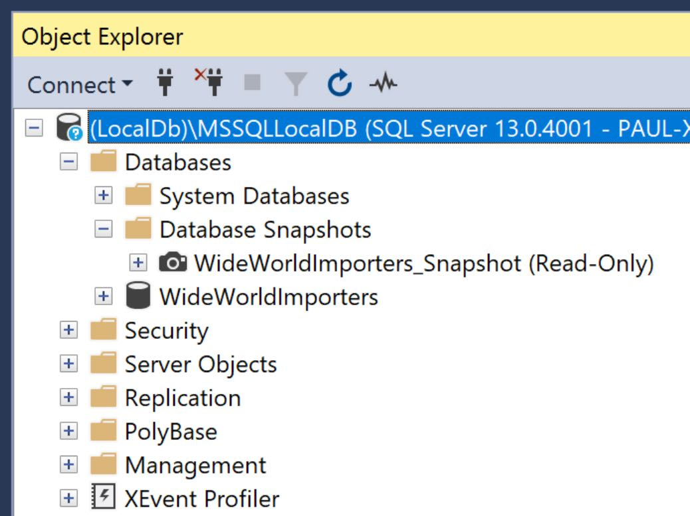
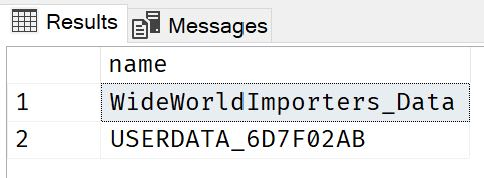

+++
title = 'Keep your dev loop as short as possible with SQL Server Snapshots'
summary = 'Discover the power of SQL Server Snapshots for managing database versions, simplifying testing, and enhancing debugging workflows in your development process. This guide explores how snapshots can mitigate the challenges of switching branches and setting up complex data scenarios, offering a faster, more reliable method for restoring databases to a known state. Learn to effortlessly navigate database changes with snapshots, keeping your local environment aligned with your development needs.'
tags = [
    "SQL Server",
    "Database Snapshots",
    "Debugging",
    "Branch Management",
    "Database Testing"
]
keywords = [
    "SQL Server Snapshots",
    "Database versioning for developers",
    "Managing database changes",
    "SQL Server development best practices",
    "Debugging with SQL Server",
    "SQL database branching strategy",
    "Restoring SQL Server databases quickly",
    "SQL Server snapshot creation",
    "Simplifying database testing",
    "Local development with SQL Server",
    "SQL Server database backups",
    "Point-in-time database recovery",
    "SQL Server management techniques",
    "Efficient database schema changes"
]
categories = ['development']
date = 2019-12-05
draft = false
aliases = ['/articles/2019-12/debugging-with-sql-server-snapshots']
[cover]
    image = 'cover_image.webp'
    alt = 'Keep your dev loop as short as possible with SQL Server Snapshots'
    caption = "Image generated by Dall-E."
    relative = true # when using page bundles set this to true
    hidden = false # only hide on current single page
	hiddenInSingle = false
+++

> _**tl;dr**_ SQL Server Snapshots are a useful feature to reduce the pain of breaking changes when switching branches or when debugging scenarios that require complex data setups.

## Problems

So what are the problems that snapshots can help with? Well, there are a couple of them that a developer might face daily...

### Switching Branches

Often when developing, you need to switch between branches e.g. `master` -> `my-feature-branch` and back again. Or you might need to switch to `someone-elses-feature-branch` so that you can review or test someone else's code. Often doing this puts your local database schema out of sync with the code and you end up with exceptions. In one branch there might be an extra column in a table for example.

Resolving these conflicts can be a pain. You waste time finding the problem and you have to come up with a script to fix it.

### Debugging Complex Data Scenarios

Bugs have a habit of happening in dark, hard to reach corners of your application. They often require a very specific set of data to reproduce them. This data setup can be a tedious and time-consuming task. Often, during the act of reproducing the bug, the data scenario you just spent time carefully creating gets deleted or changed so that you have to then spend more time re-creating it to run it again.

Ideally, you want your dev loop to be as short as possible otherwise insights and discoveries about what might be causing this bug will take longer to achieve. So it would be really useful to have a way to instantly restore this data to its original state before the code was executed.

## How can Snapshots help?

A [snapshot](https://docs.microsoft.com/en-us/sql/relational-databases/databases/database-snapshots-sql-server) of a SQL Server database is a _point-in-time_ copy of a source SQL Server database.



A snapshot is somewhat similar to a `.bak` or `.bacpac` backup, in so much as they are all _copies_ of the database. These methods though involve exporting a copy of the source database to a file which you can later restore when needed.

A snapshot is slightly different, it is also a point-in-time copy of your source database. When created it becomes an _attached_ _read-only_ copy of the source. A snapshot is shown in SQL Server Management Studio, under a menu folder called _'Database Snapshots'_ (shown above). You can access and browse these just like regular databases. They are read-only though so they can't be modified.

You might be wondering, if a snapshot is read-only, what use can it be? Well, another cool feature of a database snapshot is that you can restore _from_ them back to a regular database. And it's fast. A lot faster than restoring from a `.bak` or `.bacpac` for example.

Let's have a look at the process.

## Working with Snapshots

Here are the typical steps of how you can work with a snapshot: -

1. Create the known good state of local database (either manually or grab a copy of a production database).
2. Create a snapshot of your local database in this known state that you'll return to each time.
3. _Do the thing that messes up your local Db_. i.e. Reproduce a bug that needs a complex data scenario (_data gets ruined in the process_) or make schema changes in another branch etc.
4. Restore your local database from the snapshot.
5. Repeat from step 3 (or 1) as needed!

## Creating a Snapshot

So once your local source database is in the known good state that you wish to capture, you're ready to create a snapshot of it.

> NOTE: In these examples, I'll be using the [_World Wide Importers_](https://github.com/microsoft/sql-server-samples/tree/master/samples/databases/wide-world-importers) example database which you can download from [here](https://github.com/microsoft/sql-server-samples/releases/download/wide-world-importers-v1.0/WideWorldImporters-Standard.bak).

Here's what the SQL looks like for my `WideWorldImporters` database looks like.

```SQL
DROP DATABASE IF EXISTS [WideWorldImporters_Snapshot];

CREATE DATABASE [WideWorldImporters_Snapshot] ON
(
       NAME = 'WideWorldImporters_Data',
       FILENAME = 'C:\MySnapshots\WideWorldImporters_Data.ss'
),
(
       NAME = 'USERDATA_6D7F02AB',
       FILENAME = 'C:\MySnapshots\USERDATA_6D7F02AB.ss'
)
AS SNAPSHOT OF [WideWorldImporters];
GO
```

First we drop any existing snapshot. This just makes it easier to quickly update the snapshot.

When creating a snapshot we need to make copies of each data file of the source database. In this example, we have two datafiles named `WideWorldImporters_Data` or `USERDATA_6D7F02AB` so there is a section for each in the `CREATE` statement. In each section, we specify the file where we'd like to save the snapshot file. The convention is to name these file with an `.ss` extension.

To find the names of your data files you can run the following `SELECT` statement and use the results to construct your own `CREATE` statement.

```SQL
SELECT [name] FROM [sys].[master_files] WHERE [database_id] = DB_ID('WideWorldImporters') AND [type] = 0;
```



## Restoring from a Snapshot

When we need to return our source database to it's know state we can restore it _from_ the snapshot. When we do this the snapshot remains unchanged. So we can restore from it as many times as we need to.

```SQL
USE [Master];
GO

ALTER DATABASE [WideWorldImporters] SET SINGLE_USER WITH ROLLBACK IMMEDIATE;
RESTORE DATABASE [WideWorldImporters] FROM DATABASE_SNAPSHOT = 'WideWorldImporters_Snapshot';
ALTER DATABASE [WideWorldImporters] SET MULTI_USER;
GO
```

Firstly, because we need to make changes to our source database we need to first switch to `master`.
Then we put the source database into single-user mode and make sure any existing connections our application might have open are closed.
This makes sure we can then restore our database from the snapshot.
Finally, we put the freshly restore the database back into mutli-user mode so it can again begin accepting connections from out application.

That's it. Your application database (`WideWorldImporters`) has now been re-created from the snapshot (`WideWorldImporters_Snapshot`).

# Conclusion

SQL Server Snapshots are useful to keep your dev loop as short as possible by allowing you to return your local database back to a known state very quickly.

Thanks for reading.
