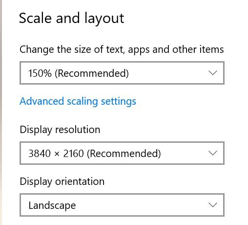

+++
title = 'SQL Server High Dpi Settings'
summary = "Overcome the challenge of distorted displays in SQL Server Management Studio on high DPI screens with this effective fix. This guide provides a straightforward solution to the common scaling issues encountered on 4K monitors, ensuring a crisp and clear SSMS interface. Whether it's disappearing buttons or weirdly scaled menus and dialogs, learn how to adjust compatibility settings and use a custom manifest file to optimize SSMS for your high-resolution display. Perfect for developers and database administrators seeking an enhanced SQL management experience."
tags = [
    "SQL Server",
    "SSMS",
    "High DPI Fix",
    "4K Resolution",
    "Display Scaling"
]
keywords = [
    "Fix SSMS high DPI issues",
    "SSMS display scaling fix",
    "SQL Server Management Studio DPI settings",
    "Adjust SSMS for 4K monitors",
    "SSMS high resolution display fix",
    "Optimize SSMS on high DPI screens",
    "SSMS manifest file fix",
    "SSMS Windows 10 scaling problem",
    "SSMS UI scaling issue",
    "SSMS compatibility settings",
    "High DPI support for SSMS",
    "SQL Server UI display fix",
    "SSMS registry fix for high DPI",
    "Improving SSMS display on 4K screens",
    "SSMS high DPI scaling override"
]
categories = ['software']
date = 2021-01-03
draft = false
aliases = ['/articles/2021-01/sql-server-high-dpi-settings', '/articles/2021-02/sql-server-high-dpi-settings']
[cover]
    image = 'cover_image.webp'
    alt = "SQL Server High Dpi Settings"
    caption = "Image generated by Dall-E."
    relative = true # when using page bundles set this to true
    hidden = false # only hide on current single page
		hiddenInSingle = false
+++

> _**tl;dr**_ This is a short note (mostly to my future self) on how to fix SQL Server Management Studio (SSMS) so that it doesn't look awful on high DPI screens.

## The Problem

I have a 4k monitor scaled at 150%. These are my preferred display settings.



When I run SSMS though I see all kinds of weirdly scaled menus, fonts and dialogs. As you can see below, the buttons are running off the edge of the dialog box.


For the record, I'm using Windows 10 (20H2) and SSMS v18.8.

If you search the internet for `SSMS high-dpi fix` there are lots of pages detailing a variety of different fixes for this problem.
I've tried many of them and some work and some don't. Every few months/years when I re-format my laptop and re-install everything again I always forget which is the one true fix. So I'm documenting what seems to work for me here so that I don't have to waste time re-discovering the fix all over again in a few months from now. YMMV.

### The Fix

1. Find the location of `Ssms.exe`, which at the time of writing for v18 is `C:\Program Files (x86)\Microsoft SQL Server Management Studio 18\Common7\IDE`.
2. Create a file called `Ssms.exe.manifest` using notepad (you will need admin privelages for this).
3. Add the following content to the file:

```XML
<?xml version="1.0" encoding="UTF-8" standalone="yes"?>
<assembly
	xmlns="urn:schemas-microsoft-com:asm.v1"
          manifestVersion="1.0"
	xmlns:asmv3="urn:schemas-microsoft-com:asm.v3">
	<dependency>
		<dependentAssembly>
			<assemblyIdentity type="win32"
			                  name="Microsoft.Windows.Common-Controls"
			                  version="6.0.0.0"
			                  processorArchitecture="*"
			                  publicKeyToken="6595b64144ccf1df"
			                  language="*"/>
		</dependentAssembly>
	</dependency>
	<dependency>
		<dependentAssembly>
			<assemblyIdentity type="win32"
			                  name="Microsoft.VC90.CRT"
			                  version="9.0.21022.8"
			                  processorArchitecture="amd64"
			                  publicKeyToken="1fc8b3b9a1e18e3b"/>
		</dependentAssembly>
	</dependency>
	<trustInfo
		xmlns="urn:schemas-microsoft-com:asm.v3">
		<security>
			<requestedPrivileges>
				<requestedExecutionLevel level="asInvoker"
				                         uiAccess="false"/>
			</requestedPrivileges>
		</security>
	</trustInfo>
	<asmv3:application>
		<asmv3:windowsSettings
			xmlns="http://schemas.microsoft.com/SMI/2005/WindowsSettings">
			<ms_windowsSettings:dpiAware
				xmlns:ms_windowsSettings="http://schemas.microsoft.com/SMI/2005/WindowsSettings">false
			</ms_windowsSettings:dpiAware>
		</asmv3:windowsSettings>
	</asmv3:application>
</assembly>
```

4. Now run `regedit` (you will also need admin privelages for this) and locate the `HKEY_LOCAL_MACHINE\SOFTWARE\Microsoft\Windows\CurrentVersion\SideBySide` section.
5. Add/Edit the DWORD(32-bit) value called `PreferExternalManifest` to have a value of `1` (as shown below). This instructs Windows to look for the `manifest` file that we added in step (2).


1. Now locate `Ssms.exe` again and right-click and select `Properties -> Compatibility -> Change settings for all users`.
2. Check `Disable full-screen optimisation` then click `Change high DPI settings`.
3. Ensure that `Progam DPI` and `High DPI scaling override` checkboxes are un-checked.


### Done!

When you next launch SSMS the disappearing buttons and other weird scaling issues should now be fixed.


Thanks for reading.
