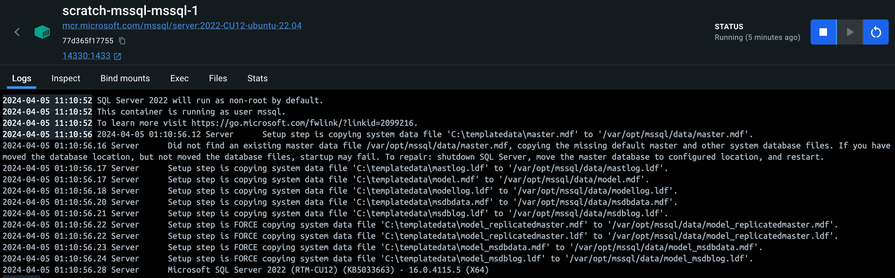
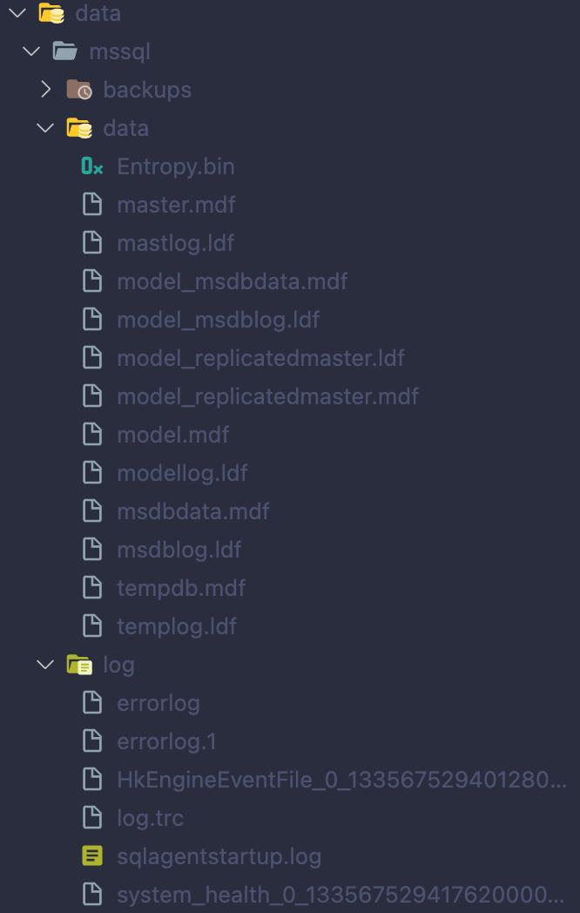
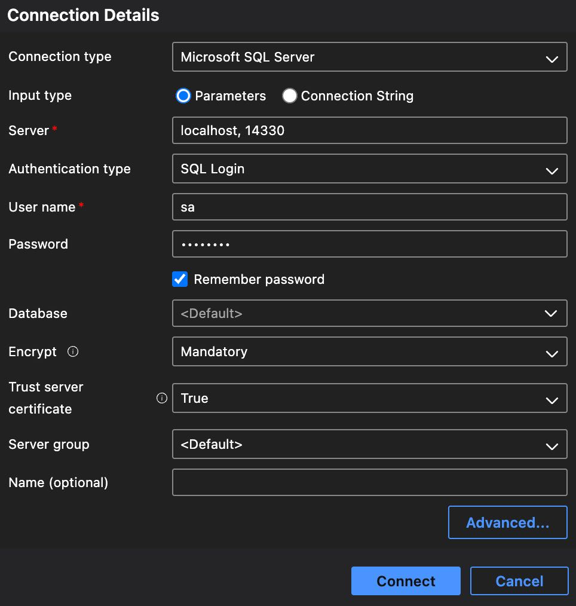
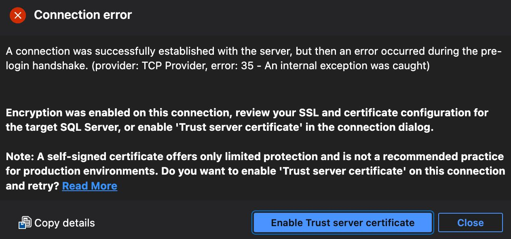
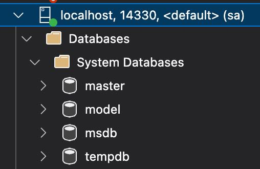

+++
title = 'Microsoft SQL Server with Docker Compose'
summary = "Unlock the power of containerised development environments with this guide to setting up Microsoft SQL server using Docker Compose. Whether you're a solo developer or part of a team, learn how to leverage Docker Compose for SQL server."
tags = [
    "SQL server",
    "Docker Compose",
    "Containerization",
    "Cross-platform Development",
    "Database Setup"
]
categories = ['development']
keywords = [
    "SQL server Docker Compose setup",
    "Docker Compose SQL server configuration",
    "SQL server on MacOS Docker",
    "Cross-platform SQL server development",
    "Dockerize SQL server for development",
    "Microsoft SQL server Docker image",
    "Setup SQL server in Docker container",
    "SQL server Docker Compose for Mac and Windows",
    "Optimal settings for SQL server Docker",
    "Run SQL server on Docker Desktop",
    "SQL server containerization guide",
    "SQL server Docker environment setup",
    "Developing with SQL server in Docker",
    "SQL server Docker Compose file example",
    "Manage SQL server containers with Docker Compose"
]
date = 2024-04-05
draft = false
series = ['SQL Server with Docker Compose']
[cover]
    image = 'cover_image.jpg'
    alt = "Microsoft SQL Server with Docker Compose"
    caption = "Image generated by Dall-E."
    relative = true # when using page bundles set this to true
    hidden = false # only hide on current single page
+++

> _**tl;dr**_ Unlock the power of containerised development environments with this guide to setting up Microsoft SQL server using Docker Compose. Whether you're a solo developer or part of a team, learn how to leverage Docker Compose for SQL server.

# Microsoft SQL Server with Docker Compose

Docker provides a great way to ensure each developer on a team has the same version and conifguration of SQL server without having to do any (error prone) manual setup or configuration themselves.

With macbooks becoming so popular with developers, I find it much more common to be working on a team of mixed Windows and Mac users. This makes it almost a necessity to use containers to provide a simple and consistent development environment that works across both platforms. One of the key sticking points has always been SQL server, since this is not installable natively on MacOS.

This article describes how to use a `docker-compose` file to configure SQL server, using what I have found to be the optimum settings for my needs and hopefully suitable for most. `docker-compose` provides an efficient way to orchestrate mutliple different containers. If you only have a single container it still provides a simple way to manage it and provides a base on which to build should you need to add more.

# Pre-Requisites

I'll be using Docker Desktop which can be downloaded [here](https://www.docker.com/products/docker-desktop/) and includes [`docker-compose`](https://docs.docker.com/compose/intro/features-uses/).

> NOTE: Commercial use of Docker Desktop at a company of more than 250 employees OR more than $10 million in annual revenue requires a [paid subscription](https://www.docker.com/pricing/). The Docker engine and CLI can be used by itself (without a subscription) however the [install and setup](https://docs.docker.com/engine/install/binaries/) of this is more complex (particularly on MacOS).

Podman + Podman Desktop is a viable alternative and also supports the use of `docker-compose` files and can be downloaded [here](https://podman.io/).

# `docker-compose` File

Without further ado, here is the `docker-compose` file. You can name this `docker-compose-mssql.yml`.

```yaml
name: scratch-mssql

services:
  mssql:
    image: mcr.microsoft.com/mssql/server:2022-CU12-ubuntu-22.04
    restart: no
    hostname: scratch-mssql
    environment:
      - ACCEPT_EULA=Y
      - MSSQL_SA_PASSWORD=${DB_PASSWORD}
      - MSSQL_PID=Developer
      - MSSQL_BACKUP_DIR=/var/opt/mssql/backups
      - MSSQL_LCID=1033
      - TZ=Etc/UTC
    ports:
      - 14330:1433
    volumes:
      - ./data/mssql/backups:/var/opt/mssql/backups
      - ./data/mssql/data:/var/opt/mssql/data
      - ./data/mssql/log:/var/opt/mssql/log

networks:
  default:
    name: scratch-mssql-net
```

Let's step through it and discuss the various aspects of it.

## `name`

```yaml
name: scratch-mssql
```

The [`name` field](https://docs.docker.com/compose/compose-file/04-version-and-name/) sets the _project name_ and helps us group all of the containers together (when we have multiple in the docker-compose file). You can see how the container group appears in Docker Desktop below.


## `services`

```yaml
services:
  mssql:
    image: mcr.microsoft.com/mssql/server:2022-CU12-ubuntu-22.04
    restart: no
    hostname: scratch-mssql
    ...
```

The [`services` section](https://docs.docker.com/compose/compose-file/05-services/) defines the containers we want to create. Right now, we've only got one - which I've named `mssql`, but you can name this whatever you prefer.

The [`image` field](https://docs.docker.com/compose/compose-file/05-services/#image) specifies which SQL server image to use. You can find the full list [here](https://hub.docker.com/_/microsoft-mssql-server) on the Docker Hub website. Note the specific use of the `2022-CU12-ubuntu-22.04` tag, which is currently the latest version. There is a `latest` tag which will always point to the latest version of the SQL server image. Typically, you will want to avoid using `latest` since we want to aim to have a consistent environment. If you are working with other developers you want everyone to be pulling the same image. If a newer version of the SQL server image becomes available, you can decide as a team if you wish to move to that newer version.

The [`restart` field](https://docs.docker.com/compose/compose-file/05-services/#restart) tells the Docker runtime when to restart the container. I prefer to manage this myself and generally don't want Docker to restart the container.

The [`hostname` field](https://docs.docker.com/compose/compose-file/05-services/#hostname) declares a custom network hostname that we can use elsewhere in our compose file if we need to.

## `environment`

```yaml
services:
  mssql:
    ...
    environment:
      - ACCEPT_EULA=Y
      - MSSQL_SA_PASSWORD=${DB_PASSWORD}
      - MSSQL_PID=Developer
      - MSSQL_BACKUP_DIR=/var/opt/mssql/backups
      - MSSQL_LCID=1033
      - TZ=Etc/UTC
```

Moving on, still within the `services` section, we have a number of [`environment` variables](https://docs.docker.com/compose/compose-file/05-services/#environment) defined. These allow us to control aspects of the SQL server configuration. You can refer to [this page](https://learn.microsoft.com/en-us/sql/linux/sql-server-linux-configure-environment-variables) for the full list of supported environment variables in the SQL server image. Typically, these ones are all that's required.

- `ACCEPT_EULA=Y`: This is required to use the image and confirms your acceptance of the End-User Licensing Agreement.
- `MSSQL_SA_PASSWORD=${DB_PASSWORD}`: Set a password for the `sa` user. This is the root user. Typically, using the `sa` user to connect to SQL server is discouraged (especially in production environments). For local dev scenarios it's usually acceptable. Note: I'm using a variable here, `${DB_PASSWORD}`, which we'll come back to below.
- `MSSQL_PID=Developer`: Sets the SQL server edition or product key. By specifying `Developer` we are licensed to use the full SQL server functionality for dev workloads only.
- `MSSQL_BACKUP_DIR=/var/opt/mssql/backups`: Specify the folder in which we want to store our database backups (\*.bak files).
- `MSSQL_LCID=1033`: Ensure we're set to `1033` which is English.
- `TZ=Etc/UTC`: This last one is not a SQL server environment variable, but a linux one and ensures that we are using the UTC timezone. You can refer to [this page](https://learn.microsoft.com/en-us/sql/linux/sql-server-linux-configure-time-zone) for more timezone information.

### env file

When configuring SQL server in a Docker container it's important to consider security. One key concern is the handling of the `sa` password. Hardcoding the password in your `docker-compose` file presents a risk if this file is shared or stored in version control. To mitigate this risk:

- Consider using [Docker secrets](https://docs.docker.com/compose/use-secrets/) to manage sensitive data securely. Docker secrets provide a mechanism to safely store and manage access to tokens, passwords, or keys, reducing the risk of exposure.
- Or use an environment variable stored outside of version-controlled files (in an `.env` file). This is the chosen approach here for simplicity, let's look at how to do it below.

Create an `.env` file in the same folder as the `docker-compose-mssql.yml` file and add the following content with the password of your choosing. The `.env` file should be excluded from `git` via your `.gitignore` file.

```
DB_PASSWORD=Y0ur!S3curePwd!
```

`docker-compose` looks for a `.env` file by default and will make available the password variable `${DB_PASSWORD}` in the `docker-compose-mssql.yml` file.

> Note: Always ensure the approach you chose for securing sensitive data is appropriate for your scenario.

## `ports`

```yaml
services:
  mssql:
    ...
    ports:
      - 14330:1433
```

The [`ports` section](https://docs.docker.com/compose/compose-file/05-services/#ports) allows us to define which port(s) we wish to expose outside of the container. This enables external applications, such as SQL server Management Studio or Azure Data Studio, to connect to SQL server running inside the container. The format `14330:1433` maps port `1433` inside the container (the default SQL server port) to port `14330` on the host. This approach allows you to run multiple instances of SQL server on different ports and avoid port conflicts with other applications.

## `volumes`

```yaml
services:
  mssql:
    ...
    volumes:
      - ./data/mssql/backups:/var/opt/mssql/backups
      - ./data/mssql/data:/var/opt/mssql/data
      - ./data/mssql/log:/var/opt/mssql/log
```

The [`volumes` section](https://docs.docker.com/compose/compose-file/05-services/#volumes) allows us to map folders on the host filesystem to folders within the container. By mapping host directories to container paths, it ensures that data remains intact even when the container is stopped or deleted. This is particularly important for databases, as it means your development data won't be lost each time you restart the SQL server container. For SQL server, mapping directories for backups, data, and logs not only facilitates data persistence but also makes it easier to access logs for debugging and to manage database backups from outside the container.

> Note: the first path before the `:` is the path on the host relative to the compose file. The path after the `:` is the path on the container.

For SQL server, I like to map these three folders: -

- `/var/opt/mssql/backups`: Remeber we set this via the envionment variable above and is the folder where backup (\*.bak files) will be stored.
- `/var/opt/mssql/data`: Will be where all of the data files (\*.mdf) and log files (\*.ldf) will be stored.
- `/var/opt/mssql/log`: Will be where SQL server stores general logging and error information. Which can be useful for debugging configuration or upgrade issues. Once you are happy that the container config is stable you may wish to comment this out.

## `networks`

```yaml
networks:
  default:
    name: scratch-mssql-net
```

The [`networks` section](https://docs.docker.com/compose/compose-file/05-services/#networks) allows us to configure different aspects of the container network. I'm using `default` here to specify that all of the services within this file will be part of the `scratch-mssql-net` network.

# Creating the Container

Open a terminal and run the following command. This will provision an instance of the image (aka a container) with all of our specific configuration.

```bash
docker-compose -f docker-compose-mssql.yml up -d
```

If you head over to Docker Desktop you should see the following. We have our `mssql-1` container running (note the `-1` denotes there a single instance) and that it's listening on port `14330`.


If for some reason your container did not start correctly and isn't running (`mssql-1` is orange rather than green), click on `mssql-1` which will open the log information which should help you diagnose the problem.



Now open the folders that you mapped as volumes and you should see that SQL server has created files within the _data_ and _log_ folders. There'll be nothing in _backups_ yet until we actually perform a backup.



# Connect to the Server

[Azure Data Studio](https://azure.microsoft.com/en-au/products/data-studio) is a great cross platform tool for connecting to a variety of databases, but primarily, SQL server. Let's connect to our new SQL server container using Azure Data Studio to check that everything is working as expected.

- Create a new connection and populate the details as follows, note the port is included in the server since we are using a custom port number.

  

- Trust the server certificate if prompted.

  

- Tada 🎉 you have connected and should see the 4 system databases indicating everything is working as expected.

  

# ARM Support on MacOS

## Rosetta Emulation

Now, thanks to _x86_64/amd64 Rosetta emulation on Apple Silicon_, everything described above should also work on ARM based Macs. In Docker Desktop settings, ensure you have the _Use Rosetta_ feature enabled.


> Note: you may see warnings about the image platform - `The requested image's platform (linux/amd64) does not match the detected host platform (linux/arm64/v8) and no specific platform was requested`. The image should work on ARM macs despite this warning. You can disable the warning by adding a `platform: linux/arm64` to the `mssql` service section.

You can read more about it in [this article](https://devblogs.microsoft.com/azure-sql/development-with-sql-in-containers-on-macos/) by Microsoft.

## azure-sql-edge

The [`azure-sql-edge` image](https://hub.docker.com/_/microsoft-azure-sql-edge) which contains a special version of SQL server designed for IoT/Edge computing _and_ can run on `arm` platforms. This makes it ideal for using as a SQL server for development on an `arm` based Mac.

> Note: There are some [unsupported features](https://learn.microsoft.com/en-us/azure/azure-sql-edge/features#unsupported-features) to be aware of, but it is mostly good enough for dev.

Create another file called `docker-compose-mssql-arm.yml` and add the following content to it.

```yaml
services:
  mssql:
    image: mcr.microsoft.com/azure-sql-edge:1.0.7
```

Execute the following command to create an instance of SQL server using all of the same config that we defined above but substituting `mcr.microsoft.com/azure-sql-edge:1.0.7` instead of `mcr.microsoft.com/mssql/server:2022-CU12-ubuntu-22.04`

> Note: We specify `1.0.7` despite there being a `2.0.0` tag. The `2.0.0` tag does not include `arm` support. This has been dropped by Microsoft since the full blown [SQL server is supported on arm via the Rosetta emulation](https://devblogs.microsoft.com/azure-sql/development-with-sql-in-containers-on-macos/).

```bash
docker-compose -f docker-compose-mssql.yml -f docker-compose-mssql-arm.yml up -d
```

> Note: the order is important. By specifying `docker-compose-mssql-arm.yml` second, the contents of `docker-compose-mssql.yml` will be overridden by the contents of `docker-compose-mssql-arm.yml`.

# Cleanup and Teardown Information

Managing the lifecycle of your Docker containers is an important aspect of working with containers.

## `down`

To stop and remove the SQL server container created with `docker-compose`, use the following command from the directory containing your `docker-compose-mssql.yml` file:

```bash
docker-compose -f docker-compose-mssql.yml down
```

This command stops and removes the containers, networks, and the default network, but not the volumes, preserving your data. If you wish to completely remove the data and start afresh, you can manually delete the folders specified in the volumes section.

## `stop` & `start`

`docker-compose` also provides the option to only stop the services:

```bash
docker-compose -f docker-compose-mssql.yml stop
```

This command stops the running containers without removing them, allowing you to start them again later with `start`.

```bash
docker-compose -f docker-compose-mssql.yml start
```

## `--force-recreate` option

The `--force-recreate` flag is a useful option for ensuring that containers are freshly created to reflect the latest configurations, especially when changes are made that don't affect the image directly. It's used with the `docker-compose up` command, forcing `docker-compose` to ignore and remove existing containers and create new ones from the updated configuration or environment variables. This option is particularly useful when troubleshooting unexpected behavior by starting with a clean state.

```bash
docker-compose -f docker-compose-mssql.yml up -d --force-recreate
```

When applying `--force-recreate`, it's important to be mindful of data persistence. Data stored in volumes will remain intact, but any data within the container's writable layer will be lost. As such, `--force-recreate` should be used when data backups have been performed if necessary. This ensures that your environment remains consistent and up-to-date with your current configurations.

# More on GitHub

I have captured the SQL server compose file discussed here (and others) in a [repo on GitHub](https://github.com/pm7y/DockerExamples).

---

Thanks for reading. How do you do it? Please leave a comment with your own tips.
