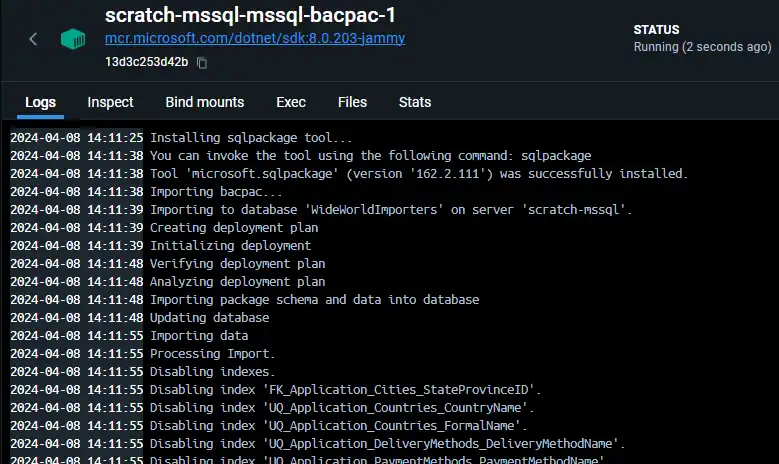

+++
title = 'Part II: Initialising SQL Server with Docker Compose'
summary = "This article explores three effective methods for initialising a SQL Server container using Docker Compose: execution of SQL scripts, leveraging mssql-tools, and restoring from a bacpac."
tags = [
  "SQL Server",
  "Docker Compose",
  "Database Initialization",
  "mssql-tools",
  "bacpac Restore"
]
categories = ['development']
keywords = [
  "SQL Server Docker Compose initialization",
  "Automating SQL Server setup",
  "Docker Compose mssql",
  "SQL script execution Docker",
  "SQL Server container setup",
  "Database automation in Docker",
  "mssql-tools container",
  "SQL Server bacpac restore",
  "Docker Compose database setup",
  "SQL Server Docker automation"
]

date = 2024-04-06
draft = false
series = ['SQL Server with Docker Compose']
[cover]
    image = 'cover_image.webp'
    alt = "Initialising SQL Server with Docker Compose"
    caption = "Image generated by Dall-E."
    relative = true # when using page bundles set this to true
    hidden = false # only hide on current single page
    hiddenInSingle = false
+++

> _**tl;dr**_ This post delves into three strategies for initialising a SQL Server using Docker Compose, tailored for developers seeking to streamline their database setup processes. Starting from a basic `docker-compose` configuration, it covers executing a SQL script directly within the container, utilising an `mssql-tools` container for script execution, and restoring a database from a `bacpac` file.

# Intro

In a [previous post](../2024-04-05-sql-server-with-docker-compose/) I looked at creating a SQL server container using Docker Compose. When the new container is created and started you will have an empty SQL server that you can initialise. By _initialise_, I just mean whatever setup you need to do for your particular project to get SQL server it into a usable state after creation. I am mainly thinking of optimising developer loops here, not production deployment scenarios.

Some examples of initialisation might be:

- Running a SQL script
  - to create the initial schema
  - to ensure some aspect of SQL server is enabled e.g. the broker
  - to create the initial database users
  - change the default settings e.g. collation
- Restoring a database
  - via a dacpac/bacpac file
  - via a bak file

 You can do these things manually via an IDE such as Azure Data Studio, but manual steps could become tedious if this container is one you'll be tearing down and re-creating frequently. Also, you might want to automate it so that other users of the container fall into the pit of success and provide everyone with a consisent setup.

So, let's look at three different ways of how we can initialise SQL server using Docker Compose.

# Starting Point

Our starting point will be the `docker-compose-mssql.yml` file from the [previous post](../2024-04-05-sql-server-with-docker-compose/). If you haven't already, you might want to read that post first to see how we arrived at the following `docker-compose` file.

```yaml
name: scratch-mssql

services:
  mssql:
    image: mcr.microsoft.com/mssql/server:2022-CU12-ubuntu-22.04
    restart: no
    hostname: scratch-mssql
    environment:
      - ACCEPT_EULA=Y
      - MSSQL_SA_PASSWORD=${DB_PASSWORD}
      - MSSQL_PID=Developer
      - MSSQL_BACKUP_DIR=/var/opt/mssql/backups
      - MSSQL_LCID=1033
      - TZ=Etc/UTC
    ports:
      - 14330:1433
    volumes:
      - ./data/mssql/backups:/var/opt/mssql/backups
      - ./data/mssql/data:/var/opt/mssql/data
      - ./data/mssql/log:/var/opt/mssql/log

networks:
  default:
    name: scratch-mssql-net
```

We'll build on this base in the following three ways.

# 1. Executing a SQL script by overriding `command`

The first approach involves using `sqlcmd` (which is included as part of the `mssql` image) and is a Microsoft utility that allows SQL statements to be executed against a SQL server. We'll use it to execute a SQL script once the container has started.

To execute a SQL script using `sqlcmd` we'll use the [`command` feature](https://docs.docker.com/compose/compose-file/05-services/#command) of a `docker-compose` file to override the existing container startup command. The customised command is shown below which might look a bit daunting at first, but let's step through it in more detail.

```yaml
services:
  mssql:
    command: >
      /bin/bash -c "
      /opt/mssql/bin/sqlservr &

      until /opt/mssql-tools/bin/sqlcmd -l 1 -S scratch-mssql -U sa -P '${DB_PASSWORD}' -Q 'SELECT 1' &> /dev/null; do
        >&2 echo '>>>>>>>>>> SQL Server is unavailable - sleeping <<<<<<<<<<';
        sleep 5;
      done;
      echo '>>>>>>>>>> SQL Server is ready - executing init script <<<<<<<<<<';
      /opt/mssql-tools/bin/sqlcmd -l 5 -S scratch-mssql -U sa -P '${DB_PASSWORD}' -d master -i /tmp/mssql-init.sql;

      sleep infinity;"
    volumes:
      - ./mssql-init.sql:/tmp/mssql-init.sql
```

First we start SQL server by calling `/opt/mssql/bin/sqlservr`. This is a blocking call, i.e. the script will be blocked on the this line, so we make it a background task (via the `&`) so that we can continue to execute more commands while the server is starting up.

We use an `until/do` loop to check if SQL server has started yet by executing a simple SQL query `SELECT 1` using `sqlcmd`, and we send the output to `/dev/null` since we aren't interested in seeing the output. If the script fails then we `do` an `echo` statement to indicate that the script will `sleep` for `5` seconds. The loop continues this until the SQL server becomes available then we exit the loop.

Now we make call to `sqlcmd` to execute another SQL script, this time from a file `mssql-init.sql` which we have made available via the `volumes` section. You can put whatever SQL statements you need for your scenario into this file.

Finally, we call `sleep infinity` to prevent the command script from exiting (which would stop the container).

> Note: that whenever the container is started, this SQL script will be executed so the script should be written in such a way that it can be excuted multiple times without causing any adverse side effects or errors. i.e. should be idempotent.

## Try it

Copy the above into a new file called `docker-compose-mssql-init-cmd.yml` and execute it using the command below. Note that we chain the file together with the base compose file. This superimposes the new `command` section above ontop of the base section.

**Create the container**

```bash
docker-compose -f docker-compose-mssql.yml -f docker-compose-mssql-init-cmd.yml up -d
```

## Review
While not inherently bad practice, modifying the `command` of an image in this way is typically not an ideal thing to do for a few reasons:

- **Loss of Default Functionality**: right now all the `CMD` in the base image does is call `/opt/mssql/bin/sqlservr`. We can see this in the [Dockerfile in the GitHub repo](https://github.com/microsoft/mssql-docker/blob/master/linux/mssql-server-linux/Dockerfile). But what if this changes in the future and Microsoft adds more logic other than simply starting the server. By modifying the `command` we are opting out of whatever logic is in the base image `CMD`.
- **Complexity and Maintenance Overhead**: Overriding commands directly can lead to configurations that are harder to understand, especially for new developers joining a project. Official images (i.e. from Microsoft) come with documentation that explains how the container is intended to be used, including the default command and its purpose. Overriding this command without adequate documentation in your project can lead to confusion.
- **Deviation from Image Specifications**: Immutability, in the context of containers, is a principle that emphasises the unchangeability of containers once they have been created. Overriding the command in a Docker Compose file can be seen as a deviation from these immutable characteristics.

# 2. Executing a SQL script via an `mssql-tools` container

Let's look at acheiving the same thing, i.e. executing a SQL script via `sqlcmd`, in a way that doesn't involve overriding the `command` of the base image. We can do this by creating a new container based on Microsoft's `mssql-tools` image. This is a simple image that only contains the `sqlcmd` tool.

```yaml
services:
  mssql-tools:
    image: mcr.microsoft.com/mssql-tools:latest
    restart: no
    command: "/opt/mssql-tools/bin/sqlcmd -S scratch-mssql -l 60 -U sa -P '${DB_PASSWORD}' -d master -i /tmp/mssql-init.sql"
    depends_on:
      - mssql
    volumes:
      - ./mssql-init.sql:/tmp/mssql-init.sql
```

So here we are defining a completely new container called `mssql-tools` which uses the [`mssql-tools` image](https://hub.docker.com/_/microsoft-mssql-tools). It `depends_on` our `mssql` container which means this container won't start until the `mssql` container has started. We use a simple `command` to  invoke `sqlcmd` to run our initialisation script which, we have mounted via the `volumes` section. Once the script has been executed the container will stop running.

## Try it

Copy the content above into a new file called `docker-compose-mssql-init-tools.yml` and create the container with the following command, which like before, works in tandem with our original base SQL server container.

**Create the container**

```bash
docker-compose -f docker-compose-mssql.yml -f docker-compose-mssql-init-tools.yml up -d
```

> Note: Remove created containers from the previous step with: \
    `docker-compose -f docker-compose-mssql.yml -f docker-compose-mssql-init-cmd.yml down`

## Review

The `mssql-tool` image is provided specifically for this purpose and so we are not violating any of the unwritten _rules_ that the previous example did. The container will start, execute the script, and exit. Unlike the previous example, the container has one purpose and we have a nice separation of concerns now between the SQL server container and the container that runs the initialisation.

The only slight drawback is that we now have this additional container which is going to live for a brief few seconds and then hang around forever unless we delete it. Not a big deal though and definately preferable, I think, to overriding the `command` as we did in the first example.

# 3. Restoring a `bacpac` via `SqlPackage`

Ok so our two examples above focussed on ways to execute a SQL script in order to initialise our environment. But what if we want to restore a whole database into our SQL server container. We can do this with a `bacpac` file and the `SqlPackage` tool.

> Note: When you need to export a database for archiving or for moving to another platform, you can export the database schema and data to a `bacpac` file. A `bacpac` file is a zip file with an extension of `.bacpac` containing the metadata and data from the database. A `.dacpac` file is similar but only contains the schema.

In this example I'll use the _WideWorldImporters_ `bacpac` file which is sample database provided by Microsoft and is available [here](https://github.com/Microsoft/sql-server-samples/releases/tag/wide-world-importers-v1.0). You can create your own `bacpac` in a variety of different ways, but the simplest is [via Azure Data Studio](https://learn.microsoft.com/en-us/azure/azure-sql/database/database-export).

```yaml
services:
  mssql-bacpac:
    image: mcr.microsoft.com/dotnet/sdk:8.0.203-jammy
    restart: no
    command: >
      /bin/bash -c "
      echo 'Installing sqlpackage tool...';
      export PATH=/root/.dotnet/tools:/usr/share/dotnet:/usr/bin;
      dotnet tool update microsoft.sqlpackage --global --verbosity minimal;

      echo 'Importing bacpac...';
      sqlpackage /Action:Import
      /TargetDatabaseName:WideWorldImporters
      /TargetServerName:scratch-mssql
      /TargetUser:sa
      /TargetPassword:'${DB_PASSWORD}'
      /SourceFile:/tmp/WideWorldImporters-Standard.bacpac
      /TargetTrustServerCertificate:true
      /TargetTimeout:60;"
    depends_on:
      - mssql
    volumes:
      - ./WideWorldImporters-Standard.bacpac:/tmp/WideWorldImporters-Standard.bacpac
```

We are defining a new container called `mssql-bacpac` which uses the [`dotnet/sdk:8.0.203-jammy` image](https://hub.docker.com/_/microsoft-dotnet-sdk/). As before, it `depends_on` our `mssql` container so it won't start until the `mssql` container has started. This time however we have a bit more of a complex `command` which ultimately installs `SqlPackage` as a dotnet tool. Then we can call `SqlPackage` to `import` the `bacpac` which we mounted via the `volumes` section. Once the import has been executed the container will stop running.

## Try it

Copy the content above into a new file called `docker-compose-mssql-init-bacpac.yml` and create the container with the following command, which like before, works in tandem with our original base SQL server container.

**Create the container**

```bash
docker-compose -f docker-compose-mssql.yml -f docker-compose-mssql-init-bacpac.yml up -d
```
> Note: Remove created containers from the previous step with: \
  `docker-compose -f docker-compose-mssql.yml -f docker-compose-mssql-init-tools.yml down`

**Output shown in Docker Desktop**



## Review

As with the preceeding example, the container has one purpose and we also have a nice separation of concerns. The `mssql-bacpac` will run for a few seconds while the `bacpac` is imported, then exit, leaving us with a full database in our `mssql` SQL server that is ready to use.

# Conclusion

We have explored a few different ways to initialise a SQL server container each with there own pros and cons. In the end I definitely prefer using the separate container approach of examples 1 and 2. It does mean you potentially have a container you need to delete once it's served it's purpose. This feels like a small price to pay for having a nice separation of concerns between the SQL server and initialisation containers. Anyway, choose the approach that best fits your needs and remember there are no doubt many other ways to achieve thing. I encourage you to experiment with these techniques, adapt them to fit your unique scenarios, and share your insights, variations, or entirely new approaches in the comments or through contributions to the accompanying GitHub repository mentioned below.

# More on GitHub

I have captured the SQL server compose files discussed here (and others) in a [repo on GitHub](https://github.com/pm7y/DockerExamples).

---

Thanks for reading. Please leave a comment below with your own ways of initialising a SQL server container.
