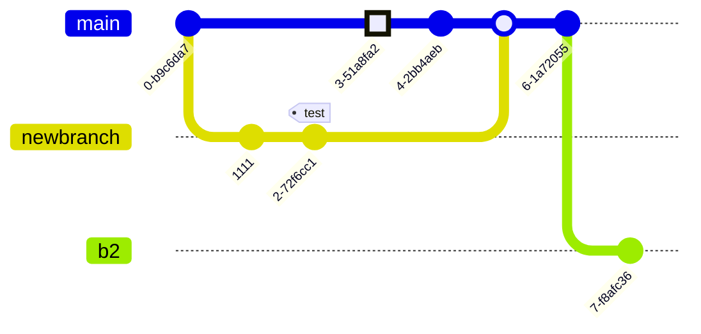

+++
title = 'Mermaid Diagrams with Markdown'
summary = 'Mermaid Diagrams with Markdown.'
tags = ['docker', 'podman']
categories = ['development']
keywords = ['docker', 'podman']
date = 2024-05-01
draft = true
# [cover]
#     image = 'cover_image.webp'
#     alt = "Using an Azure function to get Octopus deployment notifications in Slack"
#     caption = "Image generated by Dall-E."
#     relative = true # when using page bundles set this to true
#     hidden = false # only hide on current single page
#     hiddenInSingle = false
+++

https://navendu.me/posts/adding-diagrams-to-your-hugo-blog-with-mermaid/

https://learn.microsoft.com/en-us/azure/devops/project/wiki/markdown-guidance?view=azure-devops
https://mermaid.js.org/syntax/flowchart.html
https://marketplace.visualstudio.com/items?itemName=bierner.markdown-mermaid
https://plugins.jetbrains.com/plugin/20146-mermaid
https://mermaid.live/
https://stackoverflow.com/questions/56885259/stop-vscode-preview-from-scrolling
https://c4model.com/

# Flowchart

https://mermaid.js.org/syntax/flowchart.html

# Flowchart (complex)

# Sequence

https://mermaid.js.org/syntax/sequenceDiagram.html

# Class

https://mermaid.js.org/syntax/classDiagram.html

# State

https://mermaid.js.org/syntax/stateDiagram.html

# User Journey

https://mermaid.js.org/syntax/userJourney.html

# Gantt

https://mermaid.js.org/syntax/gantt.html

# Pie

https://mermaid.js.org/syntax/pie.html

# Requirement

https://mermaid.js.org/syntax/requirementDiagram.html

# Git Graph

https://mermaid.js.org/syntax/gitgraph.html

