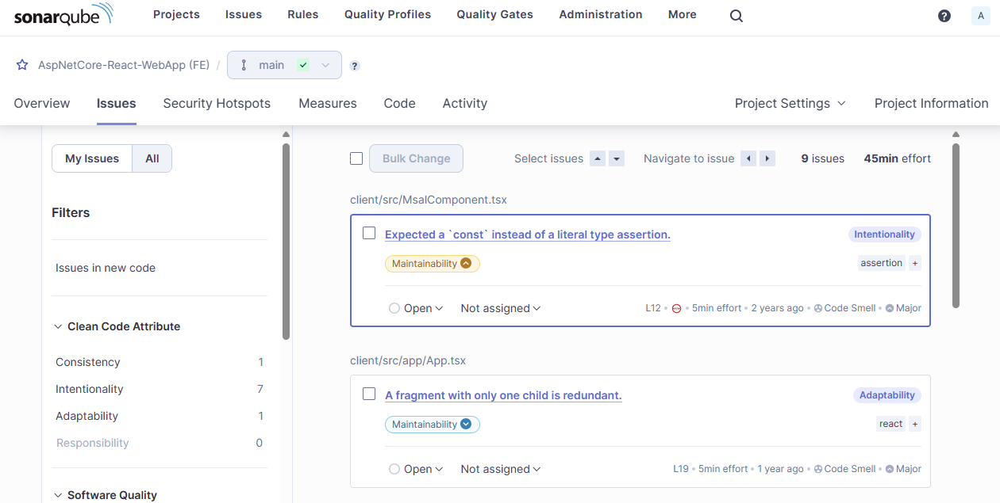

+++
title = 'SonarQube with Docker Compose'
summary = 'How to set up a SonarQube server using Docker Compose. I cover the configuration of both the database and the SonarQube server, and provide step-by-step instructions for integrating and scanning backend and frontend projects using SonarScanner for .NET and SonarScanner. This guide is perfect for developers looking to experiment with SonarQube locally.'
tags = [
    "SonarQube",
    "Docker",
    "DevOps",
    "Code Quality",
    "Tech Debt"
]
categories = ['development']
keywords = [
    "SonarQube Docker Compose",
    "SonarQube setup guide",
    "Docker Compose tutorial",
    "SonarQube Community Edition",
    "SonarScanner for .NET",
    "SonarScanner for JavaScript",
    "static code analysis",
    "technical debt management",
    "SonarQube database configuration",
    "Docker Compose Postgres"
]

date = 2024-05-15
draft = false
[cover]
    image = 'cover_image.webp'
    alt = "SonarQube with Docker Compose"
    caption = "Image generated by Dall-E."
    relative = true # when using page bundles set this to true
    hidden = false # only hide on current single page
    hiddenInSingle = false
+++

# Creating a SonarQube Server with Docker Compose

> _**tl;dr**_ How to set up a SonarQube server using Docker Compose. I cover the configuration of both the database and the SonarQube server, and provide step-by-step instructions for integrating and scanning backend and frontend projects using SonarScanner for .NET and SonarScanner. This guide is perfect for developers looking to experiment with SonarQube locally.

## Introduction

[Technical debt](https://en.wikipedia.org/wiki/Technical_debt) refers to the concept in software development of taking shortcuts to speed up project delivery, which can lead to increased costs later. This debt occurs when teams choose, either intentionally or unintentionally, an easier or quicker solution rather than the best approach to solving a problem. Over time, these shortcuts may hinder software performance, scalability, and maintainability, leading to higher costs due to extra work needed to resolve these issues.

Ignoring technical debt can lead to a situation where the software becomes so cumbersome and costly to maintain that further development is significantly slowed down or even halted. So it's important to make tackling and reducing technical debt a priority throughout the development lifecycle.

SonarQube is a static analysis tool that gives us a way to analyse and quantify issues within our code base. It allows us to track trends over time and ensure we're managing technical debt and complexity effectively. For more information, and details of the features, you can visit the [product page](https://www.sonarsource.com/products/sonarqube/).

## The Different Flavours of SonarQube

SonarQube and its related tools come in a few different forms:

- [SonarLint](https://www.sonarsource.com/products/sonarlint/): SonarLint is a code analysis tool that integrates directly into your IDE and provides quick feedback on your code quality. Unlike SonarQube, which is used to analyse the entire project at specific points in the development lifecycle, SonarLint operates directly in your IDE as you code. A server is not needed. This allows immediate detection and correction of coding errors, bugs, security vulnerabilities, and other code quality issues. This is free to use and is definitely worth [installing](https://www.sonarsource.com/products/sonarlint/ide-login/) to get quick feedback as you code.

- [SonarQube](https://www.sonarsource.com/products/sonarqube/): SonarQube comes in a few different flavours: Community, Developer, Enterprise and Data Center Editions. You can [refer to this feature matrix](https://www.sonarsource.com/products/sonarqube/downloads/) to see the differences between them. This is self-managed and so you have to download, install and configure this instance of SonarQube yourself.

- [SonarCloud](https://www.sonarsource.com/products/sonarcloud/): Finally, SonarCloud is the fully managed SaaS version of SonarQube. All you need to do in sign-up, login and pay the [monthly fees](https://www.sonarsource.com/plans-and-pricing/#sonarcloud).
  
Since the Community Edition of SonarQube is free, this is what I'll be using in this article in conjunction with Docker. So let's get into it and look at the steps needed to setup an instance of SonarQube (Community Edition) using Docker Compose. I'm going to assume you already have experience using Docker and Docker Compose files.

> NOTE: You can refer to my [previous article](/content/post/2024-04-05-sql-server-with-docker-compose/) about using Docker Compose if you are not familiar with it.

## SonarQube Requirements

The full installation requirements of SonarQube are detailed on their [website](https://docs.sonarsource.com/sonarqube/9.9/requirements/prerequisites-and-overview/), but here is a summary:

- Java 17, specifically.
- A database: SQL Server, Oracle and Postgres are supported. I'll be using Postgres since it seems to be the one best supported and used in the documentation.
- A modern browser like Edge, Chrome or Firefox etc.

# Disclaimer

My setup here is not intended for production use in a security-conscious environment. I'm really just targeting personal use by a developer wanting to experiment. In order to make a SonarQube instance available for team use and available on the internet or within a company network you would need to consider other security and privacy requirements when doing so.

## Set up

If you don't have it installed already, you'll need to download and install [Docker Desktop](https://www.docker.com/products/docker-desktop/). There are other container management solutions available but Docker Desktop is by far the easiest to use.

Create a file called `docker-compose-sonarqube.yml` and add the following content as a start. We'll update this in the sections below.

``` yaml
name: sonarqube

services:
    #db:
        # TODO
    #sonarqube:
        # TODO
        
networks:
  default:
    name: sonarqube-net  

```

## Configure Database Server

I'm choosing to use Postgres but you could use SQL Server or Oracle if you prefer. The [install requirements](https://docs.sonarsource.com/sonarqube/9.9/requirements/prerequisites-and-overview/#database) indicate that version 15 is the maximum supported (at the time of writing) even though version 16 is currently available. I'll stick with v15 to be safe.

As part of the db setup we'll need to create a database to hold the SonarQube schema and data. Create a file called `sonarqube_postgres_init.sql` and add the following SQL which creates a new database and grants permissions to the default Postgres user.

``` sql
CREATE DATABASE sonarqube;
GRANT ALL PRIVILEGES ON DATABASE sonarqube TO postgres;
```

Now update the Docker Compose file `docker-compose-sonarqube.yml` so that the `db` section looks like this.

- `${DB_PASSWORD}` is the password to use for the account, which in this case is coming from a `.env` file I have in the same directory as my Docker Compose file.
- `healthcheck` ensures that the container is considered `ready` when the health check completes successfully (i.e. can query for some basic data). This avoids the container reporting as `ready` when the database is still initialising.
- `volumes`: the SQL file is mapped to a special Docker directory supported by Postgres. Any SQL script inside `docker-entrypoint-initdb.d` will be run automatically when the container starts for the first time so we can make use of this to execute our initialisation script.
- `PGDATA`: this allows us to specifically map a host folder to the container folder where Postgres stores its data files and gives us better visibility and control over the database files so that we don't corrupt or lose them. Remember the benefit of SonarQube is monitoring code trends over time so we need to be careful we don't lose the data when we are managing the container.

``` yaml

  db:
    # https://hub.docker.com/_/postgres
    image: postgres:15.7-alpine3.19
    restart: no
    hostname: sonarqube-db
    environment:
      - POSTGRES_DB=postgres
      - POSTGRES_USER=postgres
      - POSTGRES_PASSWORD=${DB_PASSWORD}
      - TZ=Etc/UTC
      - PGDATA=/var/lib/postgresql/data
    healthcheck:
      test: "pg_isready --username=postgres && psql --username=postgres --list"
      timeout: 10s
      retries: 20
    volumes:
      - ./data/sonarqube-db:/var/lib/postgresql/data
      - ./sonarqube_postgres_init.sql:/docker-entrypoint-initdb.d/sonarqube_postgres_init.sql
```

You can check this works before moving on by running the following command.

``` bash
docker-compose -f docker-compose-sonarqube.yml up -d
```

## Configure SonarQube Server

Next, we'll add the necessary configuration to add SonarQube to the mix. I'll be using the `10.5.1-community` Docker [image](https://hub.docker.com/_/sonarqube) which is the latest at the time of writing. There is also an LTS version (`9.9.5-community`) which you might prefer to use for a more stable and supported platform. But I'll live on the edge!

Add the following section to the `docker-compose-sonarqube.yml` file so that the `sonarqube` section looks like this below.

Not too much to say here really, it should be fairly self explanatory. The `sonarqube` service `depends` on the `db` service being fully _up_ and _healthy_ (as we discussed above).

``` yaml
  sonarqube:
    # https://hub.docker.com/_/sonarqube
    image: sonarqube:10.5.1-community
    restart: no
    hostname: sonarqube
    depends_on:
      db:
        condition: service_healthy
    environment:
      SONAR_EDITION: community
      SONAR_JDBC_URL: jdbc:postgresql://sonarqube-db/sonarqube
      SONAR_JDBC_USERNAME: postgres
      SONAR_JDBC_PASSWORD: ${DB_PASSWORD}
    volumes:
      - ./data/sonarqube/data:/opt/sonarqube/data
      - ./data/sonarqube/logs:/opt/sonarqube/logs
      - ./data/sonarqube/extensions:/opt/sonarqube/extensions
    ports:
      - "9000:9000"
```

Now, run the update compose file to ensure it works and to start the SonarQube server for the first time by running the following command again.

``` bash
docker-compose -f docker-compose-sonarqube.yml up -d
```

After a few seconds, ensure that SonarQube started correctly by checking the logs in Docker Desktop.


## SonarQube Initial Setup

- In a browser go to `http://localhost:9000/` and at first you might see a loading page

  
  
- After a few seconds you should see a login page

  

- Login using defaults of `admin` / `admin`
- You will be prompted to set a new password

Yay, you are now logged into SonarQube!!! Now we have to set some initial configuration before we can start analysing our code. So let's do that next.

## Project Configuration

After first login, you will be presented with the following screen allowing us to create our first project. SonarQube supports integrations with several common cloud repositories such as Azure DevOps and GitHub. In order to support these though the SonarQube server needs to have a public callback url to complete the auth flow. This is beyond the scope this article but I may visit this in the future. For now, select the _Create a local project_ option.
  
  

The projects I typically work on have a React frontend and a C# WebApi backend which are usually separate projects. The way SonarQube analyses code is via a number of [different scanners](https://docs.sonarsource.com/sonarqube/9.8/analyzing-source-code/overview/). You must use the scanner that is most appropriate for your needs.
  
Unfortunately there is no single scanner that is capable of analysing both React/Typescript code _and_ .NET C# code. This means we'll need to use two different scanners: 

- [SonarScanner for .NET](https://docs.sonarsource.com/sonarqube/9.8/analyzing-source-code/scanners/sonarscanner-for-dotnet/) - This is the recommended way to launch an analysis for projects built using MSBuild or dotnet. It is the result of a collaboration between SonarSource and Microsoft.
- [SonnarScanner](https://docs.sonarsource.com/sonarqube/9.8/analyzing-source-code/scanners/sonarscanner/) - This is the scanner to use when there is no specific scanner for your build system. We'll use this to scan the React/Typescript code.

Unfortunately, this also means that we need to configure two separate projects: one for our frontend and one for the backend.

> NOTE: I'll be using a sample app from Microsoft `AspNetCore-React-WebApp` which you can get from https://github.com/microsoft/AspNetCore-React-WebApp. This has a React and .NET project.

Create a project to capture the frontend analysis.

  

Select "Use the global setting" for now, you can change this later if you wish.

  

You'll be asked to select the analysis method. We can ignore this for now. Instead navigate to `Projects` and `Create Project` and select `Local project`

  

Now, run through the same process to create another project to represent the backend project.

  

Ok, so now you have created two projects.


Let's create a global token that the SonarScanners can use to authenticate when scanning our two projects. Navigate to the `Security` tab via the `My Account` link under your user avatar. Alternatively, just browse to `http://localhost:9000/account/security`.

Enter the required details and generate a global token. Copy and paste the token and keep it safe since you won't be able to retrieve it again once you leave this screen.


## Project Scanning

Let's now scan our projects. The SonarScanners require Java which is a bit annoying if you are otherwise not a Java developer and therefore don't have it on your machine. Even the .NET scanner requires Java to be installed.

**Ensure Oracle Java JDK 17 is installed**

SonarQube seems to be quite particular about it being jdk17.

- On macOS (via homebrew)
  - `brew install openjdk@17`
  - `sudo ln -sfn /opt/homebrew/opt/openjdk@17/libexec/openjdk.jdk /Library/Java/JavaVirtualMachines/openjdk-17.jdk`
- On Windows
  - `winget install -e --id Oracle.JDK.17`
  - Ensure `java --version` returns 17
  - If you encounter java related errors, check the system environment variables
    - Ensure JDK_HOME is set to the new jdk17 path
    - Ensure that the PATH variable doesn't contain any other java installs

If you see Java errors when running the scanner (below) like this it could be due to there being multiple Java installations on your machine. Ensure that there aren't multiple versions of Java on your Path and ensure that the `JAVA_HOME` environment variable points to the Java 17 folder.


### Backend Project with SonarScanner for .NET

Install (or update) the SonarQube dotnet scanner.

`dotnet tool update --global dotnet-sonarscanner`

In order to capture coverage analysis during the unit tests we will add the `Coverlet.Collector` package to the unit test project

``` bash
dotnet add ./service/Microsoft.DSX.ProjectTemplate.Test/ package coverlet.collector
```

The SonarScanner for .NET operates in three phases:

**Begin the analysis**

``` bash
dotnet sonarscanner begin \
  /k:"AspNetCore-React-WebApp-BE" \
  /d:sonar.token="sqa_fd3b70f2f722845b53cf645612f5911c0ed66992" \
  /d:sonar.host.url="http://localhost:9000" \
  /d:sonar.cs.opencover.reportsPaths="./**/coverage.opencover.xml";
```

**Build the Project**

Build the project.

`dotnet build ./service -c release -v quiet --nologo --no-incremental;`

Run the project tests and output coverage analysis.

`dotnet test ./service -v quiet --no-build --results-directory "./service/TestResults" --collect "XPlat Code Coverage;Format=Cobertura,OpenCover";`

**End the analysis**

`dotnet sonarscanner end /d:sonar.token="sqa_fd3b70f2f722845b53cf645612f5911c0ed66992"`

When this finishes you'll now be able to see the results and it's a **pass!** There are a few issues found though, including 2 security issues. SonarQube will `Fail` a build if there significant issues found of a high severity. You can also see that the project has **68.7%** code coverage and SonarQube can show you which lines are uncovered. Pretty useful. It is also really powerful to be able to see how coverage trends over time as you project evolves.


You can spend some time looking through all the issues. The valuable thing is that SonarQube also estimates the effort involved in addressing each issue and overall it thinks there is around 1h 10mins worth of effort involved in fixing everything.


### Frontend Project with SonarScanner

Now let's scan the frontend project.

First, to allow us to output coverage stats, modify the `package.json` file to perform coverage analysis.

`"test": "react-scripts test --coverage --watchAll=false",`

Now, run install the dependencies (if you haven't already) and run the tests

`npm install`

`npm run test`

Finally, we can run the scanner. We'll do this using an ephemeral Docker image of the Sonar Scanner CLI to ensure we've got the right java environment configured.

```bash
docker run --rm \
  -v "~/src/AspNetCore-React-WebApp:/usr/src" \
  -e SONAR_HOST_URL="http://host.docker.internal:9000" \
  -e SONAR_TOKEN="sqa_fd3b70f2f722845b53cf645612f5911c0ed66992" \
  -e SONAR_SCANNER_OPTS="-Xmx512m -Dsonar.projectKey=AspNetCore-React-WebApp-FE -Dsonar.projectBaseDir=. -Dsonar.sources=./client -Dsonar.javascript.lcov.reportPaths=./client/coverage/lcov.info -Dsonar.exclusions=./client/**/*.test.tsx -Dsonar.tests=./client -Dsonar.test.inclusions=./client/**/*.test.tsx" \
  sonarsource/sonar-scanner-cli:latest;
```

Cool, it's another **pass!**. Now we have analysed the frontend project and we should be able to see the coverage and code analysis results.



## Conclusion

We've seen how to set up a local SonarQube (Community Edition) environment in Docker. Here's the full Docker Compose file for reference. It is also available in my [GitHub repo](https://github.com/pm7y/DockerExamples/tree/main/sonarqube) along with other Docker Compose examples.

``` yaml
name: sonarqube

services:
  db:
    # https://hub.docker.com/_/postgres
    image: postgres:15.7-alpine3.19
    restart: no
    hostname: sonarqube-db
    environment:
      - POSTGRES_DB=postgres
      - POSTGRES_USER=postgres
      - POSTGRES_PASSWORD=${DB_PASSWORD}
      - TZ=Etc/UTC
      - PGDATA=/var/lib/postgresql/data
    healthcheck:
      test: "pg_isready --username=postgres && psql --username=postgres --list"
      timeout: 10s
      retries: 20
    volumes:
      - ./data/sonarqube-db:/var/lib/postgresql/data
      - ./sonarqube_postgres_init.sql:/docker-entrypoint-initdb.d/sonarqube_postgres_init.sql

  sonarqube:
    # https://hub.docker.com/_/sonarqube
    image: sonarqube:10.5.1-community
    restart: no
    hostname: sonarqube
    depends_on:
      db:
        condition: service_healthy
    environment:
      SONAR_EDITION: community
      SONAR_JDBC_URL: jdbc:postgresql://sonarqube-db/sonarqube
      SONAR_JDBC_USERNAME: postgres
      SONAR_JDBC_PASSWORD: ${DB_PASSWORD}
    volumes:
      - ./data/sonarqube/data:/opt/sonarqube/data
      - ./data/sonarqube/logs:/opt/sonarqube/logs
      - ./data/sonarqube/extensions:/opt/sonarqube/extensions
    ports:
      - "9000:9000"

networks:
  default:
    name: sonarqube-net
```

We've learned how to setup a backend and frontend project and how to scan them both using the appropriate Sonar Scanner for each project type.

Now it's up to you to experiment and investigate the settings available in each project and decide what's right for your project. Then you can begin to see how the analysis results change over time so you can begin managing the tech debt within your project more effectively.


Thanks for reading.