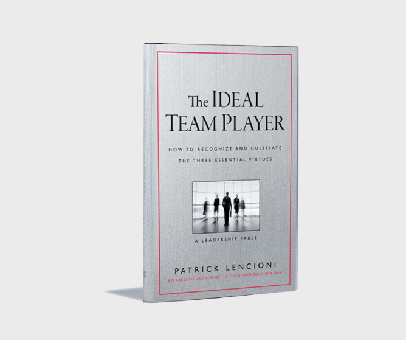

+++
title = 'Columbo & the Ideal Team Player 🕵️'
summary = "Have you ever wondered, as I have, what Columbo can teach us about being an effective Software Consultant? 🕵️ Yes? Then wonder no more. In this article, I explore the ideas in Patrick Lencioni's _The Ideal Team Player_ and show how Columbo embodies the traits of being humble, hungry, and smart. These traits can help create a productive environment, drive continuous improvement, and help build high-performing teams."
tags = [
  "Software Development",
  "Team Management",
  "Consulting",
  "Leadership",
  "Productivity"
]
categories = ['leadership']
keywords = [
  "Columbo",
  "ideal team player",
  "software consulting",
  "humility in software development",
  "Patrick Lencioni",
  "team dynamics",
  "emotional intelligence",
  "continuous improvement",
  "high-performing teams",
  "leadership in software"
]

date = 2024-06-03
draft = false
[cover]
    image = 'cover_image.webp'
    alt = "Columbo and the Ideal Team Player"
    caption = "Image generated by Dall-E and edited by me."
    relative = true # when using page bundles set this to true
    hidden = false # only hide on current single page
    hiddenInSingle = false
+++

> tl;dr: Have you ever wondered, as I have, what Columbo can teach us about being an effective Software Consultant? 🕵️ Yes? Then wonder no more. In this article, I discuss the ideas in Patrick Lencioni's [_The Ideal Team Player_](https://www.tablegroup.com/product/ideal-team-player/) and show how Columbo embodies the traits of being humble, hungry, and smart. These traits can help create a productive environment, drive continuous improvement, and help build high-performing teams.

# Introduction

> 🤖 I wrote this article, but it has been reviewed and edited with help from AI tools: ChatGPT and Grammarly.

Growing up, I used to enjoy watching early morning Sunday TV re-runs of classic shows like *Land of the Giants*, *Voyage to the Bottom of the Sea*, and *Lost in Space*. Another particular favourite was *[Columbo](https://en.wikipedia.org/wiki/Columbo)*. There was something incredibly satisfying about seeing rich, arrogant villains underestimate him, only to be brought down by his relentless pursuit of the truth. Usually, all other fictional detectives (Poirot, Sherlock Holmes, Luther) are "[Brilliant Jerks](https://www.brendangregg.com/blog/2017-11-13/brilliant-jerks.html)". Columbo was interesting because he was the best detective in the world but seemingly didn't even realise it. He treated everyone with respect, even when they didn't necessarily deserve it.

As a software consultant and a leader of development teams, I often think about how I can be more effective in my role and how I can help others to be more effective. I have found the books of Patrick Lencioni, since being referred to his book *The Five Dysfunctions of a Team* by a colleague, to be particularly insightful and useful. The majority of Lencioni's books, at least the ones I've read, are written as fictional narratives that are allegorical and help us understand broader truths.

One book in particular resonated with me: *[The Ideal Team Player](https://www.tablegroup.com/product/ideal-team-player/)*. In it, Lencioni suggests that the _ideal team player_ has three qualities: they are humble, hungry, and smart. This immediately made sense to me. All the people I've enjoyed working with over the years and learned the most from, and who have had the biggest impact on my career, have all had these three qualities. Also, while reading this book, it came to mind how Columbo also possesses these three traits. Read on as I continue to draw tenuous links between the two.

## Humble

> Being *humble* in software development means being open to feedback, recognising the value in the contributions of others, and continuously seeking to learn and grow.

Columbo's humility was one of his greatest strengths. He never _tooted his own horn_. Instead, he focused on solving the case and getting the job done. This humility made him approachable and earned him the trust of those he interacted with, even if they were initially dismissive. He never asserted his intelligence or status. Instead, he remained polite, almost deferential, allowing others to feel in control. Despite his humility, Columbo was not weak or feeble, he would stand up for himself and speak directly when necessary.

In the software world, humility is a great trait for several reasons. Whether you're a developer or a team leader, being humble means being open to feedback from peers, acknowledging your mistakes, and valuing the contributions of others. This openness creates a culture of continuous improvement and mutual respect. When team members feel their input is valued, they are more likely to share ideas and collaborate effectively.

Humility also involves recognising that you don't have all the answers and being willing to learn from others. A humble developer seeks out new knowledge and is willing to ask questions and admit when they don't know something. This attitude not only improves personal growth but also sets a positive example for the team. Just like Columbo, a humble software consultant doesn't need to boast about their skills or achievements, their work and the success of their team speak for themselves. By treating colleagues with respect and valuing their contributions, a humble consultant builds trust and contributes to a high-performing team.

> **"Humility is not thinking less of yourself, it's thinking of yourself less."** - _C.S. Lewis_

Occasionally, I or my team receive recognition via our company's internal "Appreciate" site. Don't get me wrong, it feels good to be recognised from time to time. Sometimes, though, if an individual is being recognised, it can point to a dysfunction of the team. I'd much rather see a team being recognised than an individual.

## Hungry

> Being *hungry* in software development means having a drive to learn, improve, and take on new challenges.

Columbo's hunger for the truth drove him to pursue every lead, no matter how small. He was relentless, always asking "just one more thing". This curiosity and drive to solve the case set him apart from others.

In our field, being hungry means having a "growth mindset" i.e. a strong desire to learn and improve continually. It's about being proactive, seeking out new challenges, and never settling for mediocrity. A hungry software consultant is always looking for ways to enhance their skills, whether through new technologies, methodologies, or seeking out feedback to improve their work. They are proactive in tackling new challenges and don't wait for tasks to be assigned, instead, they identify areas where they can contribute and take the initiative. A hungry leader encourages team members to pursue their professional development and provides opportunities for learning and growth.

> **"If you want to build a ship, don't drum up people to collect wood and don't assign them tasks and work, but rather teach them to long for the endless immensity of the sea."** - _Antoine de Saint-Exupéry_

A hungry consultant aims to exceed expectations, delivering high-quality work and putting in the extra effort to achieve outstanding results. This dedication leads to greater client satisfaction and successful project outcomes. Over the years, I think my sense of my own competence has changed a lot. You realise that as you gain more knowledge and experience, just how much is still out there that you know nothing about. It's a never-ending pursuit.

## Smart

> Being *smart* in software development means going beyond technical expertise to include emotional intelligence, good communication, and an understanding of the needs of the team.

Columbo's intelligence wasn't just about solving crimes, it was also about understanding people. He had a keen sense of human nature and used it to his advantage. He knew how to ask the right questions and read people's reactions.

Being smart in the context of [Lencioni's model](https://www.tablegroup.com/product/ideal-team-player/) isn't just about technical knowledge, it's also about emotional intelligence. It's about understanding your team and dealing with the complexity of working together with other humans. Smart consultants lean on the strengths of their team members, recognising the unique skills and perspectives each person brings.

A smart developer also understands the importance of clear and effective communication. They can convey complex technical concepts in a way that is accessible to non-technical stakeholders, ensuring everyone is on the same page. This skill is important for collaborative problem-solving and keeping everyone aligned on the goals of a project.

> **"The single biggest problem in communication is the illusion that it has taken place."** - _George Bernard Shaw_

Despite them being referred to as "soft skills", for me, they have been the hardest to develop. With practice and effort, you can improve these "smart" skills and use them to build trust, build relationships, deliver better project outcomes, and ensure you're steering the ship that is your own career in a deliberate direction.

## Conclusion

So, what can Columbo and Patrick Lencioni teach us about being a software consultant? Just like Columbo, the most effective software consultants are those who are humble, hungry, and smart. These traits help us build stronger teams and deliver outstanding results for our clients. By embracing these qualities and channelling our inner Columbo 🕵️ we can create a culture of continuous improvement and respect.

"Just one more thing..." - thanks for reading.
