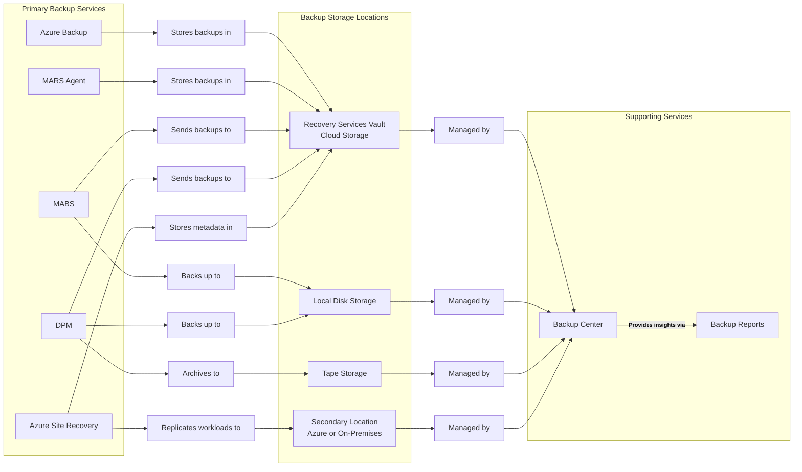

+++
title = 'Azure Backup Services: A Helpful Analogy'
summary = "This article uses the analogy of managing a digital photo collection to explain Azure's various backup and recovery services, including Azure Backup, MARS Agent, MABS, DPM, and Azure Site Recovery. It also outlines supporting services like Recovery Services Vault and Backup Center, providing an understanding of which service to use in different scenarios."
tags =  ["Azure", "Backup", "Disaster Recovery", "Cloud Computing", "Data Protection"]
categories = ['cloud']
keywords = ["azure backup services", "azure site recovery", "microsoft azure vackup server", "system center data protection manager", "azure disaster recovery", "MARS agent", "azure backup vs ASR", "azure recovery services vault", "azure backup and recovery analogy", "cloud photo backup analogy"]

date = 2024-09-16
draft = false
series = ['Azure Analogies']
[cover]
    image = 'cover_image.webp'
    alt = "Azure Backup: A Helpful Analogy"
    caption = "Image generated by Dall-E."
    relative = true # when using page bundles set this to true
    hidden = false # only hide on current single page
    hiddenInSingle = false
+++

> _**tl;dr**_ This article uses the analogy of managing a digital photo collection to explain Azure's various backup and recovery services, including Azure Backup, MARS Agent, MABS, DPM, and Azure Site Recovery. It also outlines supporting services like Recovery Services Vault and Backup Center, providing an understanding of which service to use in different scenarios.

## Introduction

> 🤖 _I created this article, but it has been reviewed and refined with help from AI tools: o1-preview and Grammarly._

As I prepare for the AZ-104 and AZ-305 exams, I’ve found the many Azure backup and recovery solutions confusing. The names often blur together, and remembering which service backs up what can be challenging. To simplify this, I've tried to come up with an analogy that resonated with my interest in digital photography.

## The Analogy: Your Digital Photo Collection

Imagine your Azure environment is like your precious collection of digital photos. Just as you take steps to protect your photos, Azure offers services to safeguard your data. Let's explore these services through this lens.

### Primary Backup Services: Protecting Your Photos

**Azure Backup**: *Your All-in-One Cloud Photo Backup*

Azure Backup is like your all-in-one cloud photo backup service. It automatically backs up all your photos from various devices to a secure cloud location—the **Recovery Services Vault**. Similarly, Azure Backup protects entire systems such as Azure VMs, file shares, databases, and even on-premises servers. It's ideal for comprehensive, automated backups without the need to worry about the details.

**Microsoft Azure Recovery Services (MARS) Agent**: *Selective Photo Album Backup*

The MARS Agent acts as your selective photo album backup. Instead of backing up everything, you choose specific photo albums or folders to safeguard, storing them directly in your secure cloud storage—the **Recovery Services Vault**. Likewise, the MARS Agent focuses on backing up particular files and folders from on-premises or Azure VMs.

**Microsoft Azure Backup Server (MABS)**: *Local Photo Organiser with Cloud Sync*

MABS functions like a local photo organiser with cloud sync capabilities. It organises your photos on your computer (using **local disk storage**) and syncs them to the cloud (**Recovery Services Vault**), giving you both local and cloud copies. MABS extends Azure Backup to handle on-premises workloads like VMs and application servers, making it suitable for hybrid environments where you want both local and cloud backups.

**System Center Data Protection Manager (DPM)**: *Professional Photo Archiving Service with Multiple Storage Options*

DPM resembles a professional photo archiving service that offers multiple storage options. Not only does it manage and archive your extensive photo collection locally on **disk** and **tape**, but it also provides offsite storage by sending copies to your secure cloud vault (**Recovery Services Vault**). DPM is an enterprise-level solution offering advanced data protection across various Microsoft applications, best suited for large organisations with complex backup needs.

**Azure Site Recovery (ASR)**: *Emergency Photo Copy on External Drive Stored Elsewhere*

Azure Site Recovery is your emergency photo copy on an external hard drive stored elsewhere. Instead of backing up to the same storage location, it replicates your entire photo library to a different location (like a **secondary site** or **another Azure region**). ASR ensures business continuity during major outages—essentially, it's your fallback if everything else fails.

### Supporting Services: Managing and Storing Your Photos

**Recovery Services Vault**: *Your Secure Cloud Photo Storage Box*

The Recovery Services Vault serves as your secure cloud photo storage box. It's like a safe deposit box where you keep your most valuable photos protected. In Azure, it's a secure storage space for your backup data and recovery points, automatically used by Azure Backup, MARS Agent, MABS, DPM, and ASR (for metadata and configurations) to store data securely.

**Backup Center**: *Photo Management Dashboard*

Backup Center is your photo management dashboard. It provides an overview of all your photo backups—whether they're stored locally, on tape, or in the cloud—and their statuses at a glance. Similarly, Backup Center is a unified hub to monitor and manage all your backups, helping you keep track and ensure everything is running smoothly.

**Backup Reports**: *Photo Backup Status Updates*

Backup Reports offer photo backup status updates. You receive notifications about how your photo backups are performing across all storage locations and if there are any issues. In Azure, Backup Reports provide insights on your backup operations, useful for auditing and optimising your backup strategy.

## Summary Table

Here's a breakdown of the services:

### **Primary Backup Services**

| Azure Service                             | Photography Analogy                              | Backs Up                                       | Backup Storage Locations                           |
| ----------------------------------------- | ------------------------------------------------ | ---------------------------------------------- | -------------------------------------------------- |
| **Azure Backup**                          | Cloud Photo Backup Service                       | Azure VMs, File Shares, Databases, On-premises | Recovery Services Vault (Cloud)                    |
| **MARS Agent**                            | Selective Photo Album Backup                     | Specific Files and Folders                     | Recovery Services Vault (Cloud)                    |
| **Microsoft Azure Backup Server (MABS)**  | Local Organiser with Cloud Sync                  | On-premises Workloads                          | Local Disk, Recovery Services Vault                |
| **System Center Data Protection Manager** | Pro Photo Archiving with Disk, Tape, and Cloud   | Enterprise Applications and Workloads          | Disk, Tape, Recovery Services Vault                |
| **Azure Site Recovery**                   | Emergency Photo Copy on External Drive Elsewhere | Entire Workloads to Secondary Location         | Secondary Site, Recovery Services Vault (Metadata) |

### **Supporting Services**

| Azure Service               | Photography Analogy         | Role                                                  |
| --------------------------- | --------------------------- | ----------------------------------------------------- |
| **Recovery Services Vault** | Secure Cloud Storage Box    | Stores Backup Data Securely                           |
| **Backup Center**           | Photo Management Dashboard  | Monitors and Manages Backups Across All Storage Types |
| **Backup Reports**          | Photo Backup Status Updates | Provides Insights on Backup Performance               |

This diagram illustrates the relationship between the primary backup services and the supporting services:

## Conclusion

By mapping Azure's backup and recovery services to elements of managing a digital photo collection, I've found it much easier to grasp their roles and remember which service does what.

Thanks for reading.
