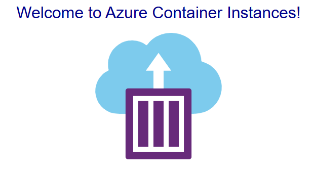

+++
title = 'Enabling HTTPS on Azure Container Instances with Caddy'
summary = "Learn how to deploy an Azure Container Instance (ACI) container group with HTTPS enabled using Caddy. This guide walks through deploying a Hello World app and securing it with SSL using a Bicep template."
tags =  ["Azure", "Bicep", "Caddy", "Containerisation", "DevOps"]
categories = ['cloud']
keywords = ["azure container instance", "aci https", "caddy web server", "bicep template", "ssl on azure", "node.js container", "caddy ssl", "deploy azure containers", "https in aci", "azure cli deployment"]

date = 2024-09-23
draft = false
series = ['Azure Container Instances']
[cover]
    image = 'cover_image.webp'
    alt = "Enabling HTTPS on Azure Container Instances with Caddy"
    caption = "Image generated by Dall-E."
    relative = true # when using page bundles set this to true
    hidden = false # only hide on current single page
    hiddenInSingle = false
+++

> _**tl;dr**_ This article demonstrates how to deploy an Azure Container Instance (ACI) container group while enabling HTTPS via Caddy, as ACI doesn't natively support SSL.

## Introduction

> 🤖 _I created this article, but it has been reviewed and refined with help from AI tools: GPT-4o and Grammarly._

[Azure Container Instances (ACI)](https://learn.microsoft.com/en-us/azure/container-instances/container-instances-overview) offer a quick and straightforward way to run containers in the cloud without managing the underlying infrastructure. However, one limitation is that ACI does not natively support HTTPS, which is a must-have for secure communication over the web. To overcome this limitation, we can use [Caddy](https://caddyserver.com/), an enterprise-ready, open-source web server that automatically provides HTTPS. In this article, we will demonstrate how to deploy an ACI container group containing both a simple [_hello world_](https://github.com/Azure-Samples/aci-helloworld) image and Caddy to provide HTTPS for the application. The hello world image is used for simplicity, but the same principal can be applied with any other container image you want to use instead.

## Bicep Template

To deploy our solution, we will use Bicep, a domain-specific language (DSL) for deploying Azure resources declaratively. Below is the Bicep code necessary to provision a container group with two containers: Caddy and the ACI Hello World app. The Caddy container will handle HTTPS traffic, forwarding requests to the Hello World container. I also have a [GitHub repository](https://github.com/pm7y/BicepTemplates) where this and other example Bicep templates can be found.

### main.bicep

The `main.bicep` file defines the parameters for the deployment and includes two modules: one for creating a storage account and file share for the Caddy container and another for deploying the ACI container group.

```bicep
@description('The location to deploy the resources to.')
param location string = 'australiaeast'

@description('The name of the container group to create.')
param containerGroupName string

@description('The name of the storage account to create.')
param storageAccountName string

@description('Create a storage account and file share to persist data for the Caddy container.')
module storageAccount './storage-account.bicep' = {
  name: toLower('deploy-storage-account-module-${storageAccountName}')
  params: {
    location: location
    storageAccountName: storageAccountName
    containerGroupName: containerGroupName
  }
}

@description('Create an ACI container group to run the Hello World and Caddy containers.')
module aci './aci.bicep' = {
  name: toLower('deploy-aci-module-${containerGroupName}')
  params: {
    location: location
    storageAccountName: storageAccountName
    containerGroupName: containerGroupName
  }
}
```

### storage-account.bicep

The `storage-account.bicep` file creates a storage account and a file share which is used by the Caddy container to persist data.

```bicep
param location string
param containerGroupName string
param storageAccountName string

resource storageAccount 'Microsoft.Storage/storageAccounts@2023-05-01' = {
  name: storageAccountName
  location: location
  sku: {
    name: 'Standard_LRS'
  }
  kind: 'StorageV2'
  properties: {
    dnsEndpointType: 'Standard'
    allowedCopyScope: 'AAD'
    allowCrossTenantReplication: false
    isSftpEnabled: false
    isNfsV3Enabled: false
    minimumTlsVersion: 'TLS1_2'
    allowBlobPublicAccess: false
    allowSharedKeyAccess: true
    largeFileSharesState: 'Enabled'
    isHnsEnabled: true
    supportsHttpsTrafficOnly: true
    accessTier: 'Hot'
    encryption: {
      requireInfrastructureEncryption: true
      services: {
        file: {
          enabled: true
          keyType: 'Account'
        }
      }
      keySource: 'Microsoft.Storage'
    }
    networkAcls: {
      bypass: 'AzureServices'
      defaultAction: 'Allow'
    }
  }
}

resource fileServices 'Microsoft.Storage/storageAccounts/fileServices@2023-05-01' = {
  parent: storageAccount
  name: 'default'
  properties: {
    protocolSettings: {
      smb: {
        versions: 'SMB3.0'
      }
    }
    shareDeleteRetentionPolicy: {
      enabled: false
      allowPermanentDelete: true
    }
  }
}

resource caddyDataFileShare 'Microsoft.Storage/storageAccounts/fileServices/shares@2023-05-01' = {
  parent: fileServices
  name: '${containerGroupName}-caddydata'
  properties: {
    shareQuota: 1
    accessTier: 'TransactionOptimized'
    enabledProtocols: 'SMB'
  }
}

output caddyDataFileShareName string = caddyDataFileShare.name

```

### aci.bicep

The `aci.bicep` file defines the container group, specifying the properties for both the Caddy container and the Hello World container:

```bicep
resource containerGroup 'Microsoft.ContainerInstance/containerGroups@2021-07-01' = {
  name: containerGroupName
  location: location
  properties: {
    containers: [
      {
        name: '${containerGroupName}-caddy'
        properties: {
          image: 'caddy:latest'
          resources: {
            requests: {
              cpu: 1
              memoryInGB: 1
            }
          }
          ports: [
            {
              protocol: 'TCP'
              port: 443
            }
            {
              protocol: 'TCP'
              port: 80
            }
          ]
          volumeMounts: [
            {
              name: caddyDataFileShareName
              mountPath: '/data'
              readOnly: false
            }
          ]
        }
      }
      {
        name: '${containerGroupName}-hello-world'
        properties: {
          image: 'mcr.microsoft.com/azuredocs/aci-helloworld:latest'
          resources: {
            requests: {
              cpu: 1
              memoryInGB: 1
            }
          }
          environmentVariables: [
            {
              name: 'PORT'
              value: '3001'
            }
          ]
          ports: [
            {
              port: 3001
            }
          ]
        }
      }
    ]
  }
}
```

## Deployment

To deploy the Bicep template, you will need the Azure CLI installed. Follow these steps to deploy the solution:

1. Create an `.env` file.
2. Populate the `.env` file with the following values:

    ```env
    TENANT_ID=
    SUBSCRIPTION_ID=
    RESOURCE_GROUP=
    LOCATION=
    CONTAINER_GROUP_NAME=
    STORAGE_ACCOUNT_NAME=
    ```

3. Save and run the PowerShell script to deploy the resources:

    ```powershell
    # Load .env file and set environment variables

    $envFilePath = ".env"
    if (Test-Path $envFilePath) {
        Get-Content $envFilePath | ForEach-Object {
            if ($_ -match "^\s*([^#][^=]+)=(._)\s_$") {
                $name = $matches[1]
                $value = $matches[2]
                [System.Environment]::SetEnvironmentVariable($name, $value)
                Write-Host "env variable: $name=$value"
            }
        }
    }

    $tenantId = [System.Environment]::GetEnvironmentVariable("TENANT_ID")
    $subscriptionId = [System.Environment]::GetEnvironmentVariable("SUBSCRIPTION_ID")
    $resourceGroup = [System.Environment]::GetEnvironmentVariable("RESOURCE_GROUP")
    $location = [System.Environment]::GetEnvironmentVariable("LOCATION")
    $containerGroupName = [System.Environment]::GetEnvironmentVariable("CONTAINER_GROUP_NAME")
    $storageAccountName = [System.Environment]::GetEnvironmentVariable("STORAGE_ACCOUNT_NAME")

    az config set core.login_experience_v2=off # Disable the new login experience to avoid console prompts
    az login --tenant $tenantId

    az account set --subscription $subscriptionId
    az group create --name $resourceGroup --location $location

    az deployment group create `
        --name caddy-hello-world `
        --resource-group $resourceGroup `
        --template-file main.bicep `
        --parameters containerGroupName=$containerGroupName `
        storageAccountName=$storageAccountName
    ```

    > Note: This script will use the values in the `.env` file to deploy the container group with both the Caddy and Hello World containers, ensuring that HTTPS is enabled for the Hello World application

4. Once deployed, if all has worked as expected, when you browse to your container group url you should see the following message. Note, the url will be in the following form: -
  
    > `https://<container-group-name>.<location>.azurecontainer.io`

    

## Conclusion

In this article, we saw how to deploy an Azure Container Instance container group that includes both a Caddy web server and a Hello World Node.js application. By using Caddy, we can easily provide HTTPS for our application, overcoming the limitation that ACI does not natively support SSL. Feel free to leave a comment about your experience or any challenges you faced while deploying this solution.

Thanks for reading.
