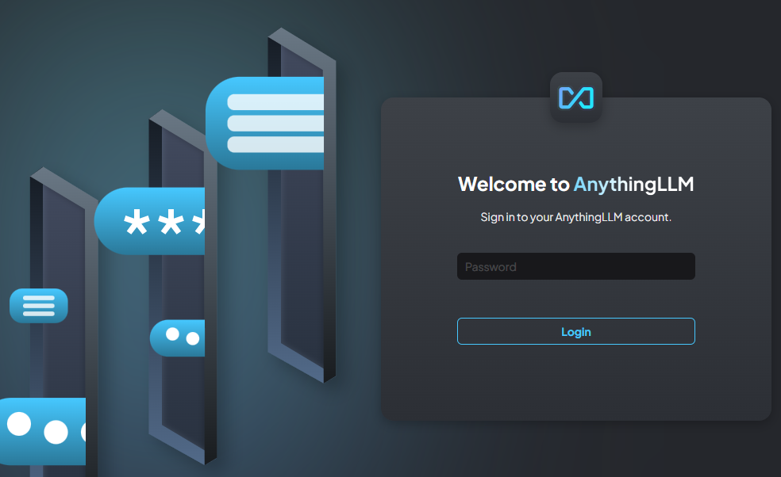

+++
title = 'Deploying AnythingLLM as an Azure Container Instance'
summary = "Some notes on deploying AnythingLLM in an Azure Container Instance using Bicep, ensuring persistent storage. AnythingLLM allows you to use multiple LLMs, using your existing API keys, with one UI."
tags =  [
    "Azure",
    "AnythingLLM",
    "Container Instances",
    "Cloud Deployment",
    "Bicep"
]
categories = ['cloud']
keywords = [
    "Azure Container Instances", 
    "AnythingLLM deployment", 
    "Caddy HTTPS", 
    "Azure Bicep template", 
    "cloud deployment", 
    "LLM APIs", 
    "persistent storage Azure", 
    "container group Azure", 
    "deploy LLM interface"
]

date = 2024-10-02
draft = false
series = ['Azure Container Instances']
[cover]
    image = 'cover_image.webp'
    alt = "Deploying AnythingLLM as an Azure Container Instance"
    caption = "Image generated by Dall-E."
    relative = true # when using page bundles set this to true
    hidden = false # only hide on current single page
    hiddenInSingle = false
+++

> _**tl;dr**_ Some notes on deploying AnythingLLM in an Azure Container Instance using Bicep, ensuring persistent storage. AnythingLLM allows you to use multiple LLMs, using your existing API keys, with one UI.

## Introduction

> 🤖 _I created this article, but it has been reviewed and refined with help from AI tools: GPT-4o and Grammarly._

[Azure Container Instances (ACI)](https://learn.microsoft.com/en-us/azure/container-instances/container-instances-overview) offer a quick and straightforward way to run containers in the cloud without managing the underlying infrastructure. [AnythingLLM](https://docs.useanything.com/) is an interesting project which provides an LLM chat interface allowing you to configure your own API keys for a variety of LLMs (e.g. [OpenAI](https://openai.com/index/openai-api/), [Anthropic](https://www.anthropic.com/api), [Google](https://ai.google.dev/gemini-api/docs/api-key) and [others](https://docs.useanything.com/setup/llm-configuration/overview#cloud-language-model-providers)).

The LLM landscape shifts regularly so not being tied to a subscription for any particular LLM is beneficial. Instead you can buy API credits for a few dollars each for a number of different LLMs and get an API key for each. You can then simply plug in the API key into [AnythingLLM](https://docs.useanything.com/setup/llm-configuration/overview#cloud-language-model-providers) and you can interact with each of them from the very same UI.

AnythingLLM can be downloaded as a desktop app [here](https://anythingllm.com/download). This will be all most people need. If you use multiple machines and want instance you can access across each machine, an alternative solution is to [deploy AnythingLLM into the cloud](https://docs.useanything.com/installation-docker/overview). In this post we'll see how to deploy your very own instance of AnythingLLM into Azure so that you can access from any browser any time you need it.

> NOTE: One limitation is that ACI does not natively support HTTPS, which is a must-have for secure communication over the web. To overcome this limitation, we can use [Caddy](https://caddyserver.com/). I'll be using that here and I discussed that in more detail in a similar [previous post](https://m7y.me/post/2024-09-23-azure-container-instance-https/).

## Bicep Template

To deploy our solution, we will use the following Bicep code necessary to provision a container group with two containers: Caddy and the AnythingLLM app. The Caddy container will handle HTTPS traffic, forwarding requests to the AnythingLLM container. I also have a [GitHub repository](https://github.com/pm7y/BicepTemplates) where this and other example Bicep templates can be found.

### main.bicep

The `main.bicep` file defines the parameters for the deployment and includes two modules: one for creating a storage account and file shares and another for deploying the ACI container group.

```bicep
@description('The location to deploy the resources to.')
param location string = 'australiaeast'

@description('The name of the container group to create.')
param containerGroupName string

@description('The name of the storage account to create.')
param storageAccountName string

@description('Set this if you are using a custom domain, e.g. via CloudFlare or similar.')
param overridePublicUrl string = ''

@description('Set this to the time zone you want to use.')
param timeZone string = 'Australia/Brisbane'

@secure()
@description('The password for the admin user. This value is used to authenticate to the AnythingLLM admin panel.')
param secureAuthToken string

@secure()
@description('Random string for seeding. Please generate random string at least 12 chars long.')
param secureJwtSecret string

@description('Create a storage account and file shares to persist data for the AnythingLLM and Caddy containers.')
module storageAccount './storage-account.bicep' = {
  name: 'allmStorageAccount'
  params: {
    location: location
    storageAccountName: storageAccountName
    containerGroupName: containerGroupName
  }
}

@description('Create an ACI container group to run the AnythingLLM and Caddy containers.')
module allmAci './aci.bicep' = {
  name: 'allmAci'
  params: {
    location: location
    storageAccountName: storageAccountName
    containerGroupName: containerGroupName
    timeZone: timeZone
    allmStorageFileShareName: storageAccount.outputs.allmStorageFileShare
    caddyDataFileShareName: storageAccount.outputs.caddyDataFileShareName
    overridePublicUrl: overridePublicUrl
    secureAuthToken: secureAuthToken
    secureJwtSecret: secureJwtSecret
  }
}
```

### storage-account.bicep

The `storage-account.bicep` file creates a storage account and a file share which is used by the Caddy and AnythingLLM containers to persist data.

```bicep
param location string
param containerGroupName string
param storageAccountName string

resource storageAccount 'Microsoft.Storage/storageAccounts@2023-05-01' = {
  name: storageAccountName
  location: location
  sku: {
    name: 'Standard_LRS'
  }
  kind: 'StorageV2'
  properties: {
    dnsEndpointType: 'Standard'
    allowedCopyScope: 'AAD'
    allowCrossTenantReplication: false
    isSftpEnabled: false
    isNfsV3Enabled: false
    minimumTlsVersion: 'TLS1_2'
    allowBlobPublicAccess: false
    allowSharedKeyAccess: true
    largeFileSharesState: 'Enabled'
    isHnsEnabled: true
    supportsHttpsTrafficOnly: true
    accessTier: 'Hot'
    encryption: {
      requireInfrastructureEncryption: true
      services: {
        file: {
          enabled: true
          keyType: 'Account'
        }
      }
      keySource: 'Microsoft.Storage'
    }
    networkAcls: {
      bypass: 'AzureServices'
      defaultAction: 'Allow'
    }
  }
}

resource fileServices 'Microsoft.Storage/storageAccounts/fileServices@2023-05-01' = {
  parent: storageAccount
  name: 'default'
  properties: {
    protocolSettings: {
      smb: {
        versions: 'SMB3.0'
      }
    }
    shareDeleteRetentionPolicy: {
      enabled: false
      allowPermanentDelete: true
    }
  }
}

resource caddyDataFileShare 'Microsoft.Storage/storageAccounts/fileServices/shares@2023-05-01' = {
  parent: fileServices
  name: '${containerGroupName}-caddydata'
  properties: {
    shareQuota: 10
    accessTier: 'TransactionOptimized'
    enabledProtocols: 'SMB'
  }
}

resource allmStorageFileShare 'Microsoft.Storage/storageAccounts/fileServices/shares@2023-05-01' = {
  parent: fileServices
  name: '${containerGroupName}-allmstorage'
  properties: {
    shareQuota: 10
    accessTier: 'TransactionOptimized'
    enabledProtocols: 'SMB'
  }
}

output caddyDataFileShareName string = caddyDataFileShare.name
output allmStorageFileShare string = allmStorageFileShare.name

```

### aci.bicep

The `aci.bicep` file defines the container group, specifying the properties for both the Caddy container and the AnythingLLM container:

#### KEY POINT

One key thing to note here is the customised `command` for the AnythingLLM container. Currently, AnythingLLM only allows for the configuration of the data storage directory. It persists it's config data in an `.env` file in a different folder that can't be mapped (ACI doesn't allow mapping of individual files).

So to work around this we can use a [symlink](https://en.wikipedia.org/wiki/Symbolic_link) to map the `.env` file into the mounted storage folder, like so: `ln -sf /app/server/storage/.env /app/server/.env`. This means that when we restart the container the configuration will be persisted.

```bicep
param location string
param containerGroupName string
param storageAccountName string
param timeZone string
param caddyDataFileShareName string
param allmStorageFileShareName string
param overridePublicUrl string = ''
@secure()
param secureAuthToken string
@secure()
param secureJwtSecret string

var publicUrl = empty(overridePublicUrl)
  ? toLower('${containerGroupName}.${location}.azurecontainer.io')
  : overridePublicUrl
var allmPort = 3001

resource storageAccount 'Microsoft.Storage/storageAccounts@2023-05-01' existing = {
  name: storageAccountName
}

resource containerGroup 'Microsoft.ContainerInstance/containerGroups@2024-05-01-preview' = {
  name: containerGroupName
  location: location
  properties: {
    sku: 'Standard'
    containers: [
      {
        name: '${containerGroupName}-caddy'
        properties: {
          // https://hub.docker.com/_/caddy
          image: 'docker.io/caddy:latest'
          command: [
            'caddy'
            'reverse-proxy'
            '--from'
            '${publicUrl}'
            '--to'
            'localhost:${allmPort}'
          ]
          resources: {
            requests: {
              cpu: 1
              memoryInGB: 1
            }
          }
          ports: [
            {
              protocol: 'TCP'
              port: 443
            }
            {
              protocol: 'TCP'
              port: 80
            }
          ]
          volumeMounts: [
            {
              name: caddyDataFileShareName
              mountPath: '/data'
              readOnly: false
            }
          ]
        }
      }
      {
        name: '${containerGroupName}-allm'
        properties: {
          // https://hub.docker.com/r/mintplexlabs/anythingllm
          image: 'mintplexlabs/anythingllm:latest'
          resources: {
            requests: {
              cpu: 1
              memoryInGB: 3
            }
          }
          command: [
            'bash'
            '-c'
            // The AnythingLLM .env file is one level up from the storage directory so we create a symlink to it.
            'touch /app/server/storage/.env && ln -sf /app/server/storage/.env /app/server/.env && /usr/local/bin/docker-entrypoint.sh'
          ]
          ports: [
            {
              port: allmPort
              protocol: 'TCP'
            }
          ]
          volumeMounts: [
            {
              name: allmStorageFileShareName
              mountPath: '/app/server/storage'
              readOnly: false
            }
          ]
          environmentVariables: [
            // https://github.com/Mintplex-Labs/anything-llm/blob/master/server/.env.example
            {
              name: 'TZ'
              value: timeZone
            }
            {
              name: 'STORAGE_DIR'
              value: '/app/server/storage'
            }
            {
              name: 'DISABLE_TELEMETRY'
              value: 'true'
            }
            {
              name: 'AUTH_TOKEN'
              value: secureAuthToken
            }
            {
              name: 'JWT_SECRET'
              value: secureJwtSecret
            }
          ]
        }
      }
    ]
    osType: 'Linux'
    restartPolicy: 'Never'
    ipAddress: {
      type: 'Public'
      dnsNameLabel: containerGroupName
      ports: [
        {
          protocol: 'TCP'
          port: 443
        }
        {
          protocol: 'TCP'
          port: 80
        }
      ]
    }
    volumes: [
      {
        name: caddyDataFileShareName
        azureFile: {
          shareName: caddyDataFileShareName
          storageAccountName: storageAccount.name
          storageAccountKey: storageAccount.listKeys().keys[0].value
          readOnly: false
        }
      }
      {
        name: allmStorageFileShareName
        azureFile: {
          shareName: allmStorageFileShareName
          storageAccountName: storageAccount.name
          storageAccountKey: storageAccount.listKeys().keys[0].value
          readOnly: false
        }
      }
    ]
  }
}
```

## Deployment

To deploy the Bicep template, you will need the Azure CLI installed. Follow these steps to deploy the solution:

1. Create an `.env` file. Populate the `.env` file with the following values:

    ```env
    TENANT_ID=
    SUBSCRIPTION_ID=
    RESOURCE_GROUP=
    LOCATION=
    ```

2. Create a `parameters.json` file. Populate the `parameters.json` file with the following initial values and update for your needs:

   - `timeZone`: Set this to the time zone you want to use. e.g. `Australia/Brisbane`
   - `containerGroupName`: The name of the container group to create.
   - `storageAccountName`: The name of the storage account to create.
   - `overridePublicUrl`: If you want to use a custom domain name set that to you url (e.g. `anythingllm.example.com`). Then in your DNS provider you will need to create a CNAME record that points `anythingllm.example.com` to the url of the container group which will be in the form `<container-group-name>.<location>.azurecontainer.io`
   - `secureAuthToken`: The password for the admin user. This value is used to authenticate to the AnythingLLM admin panel.
   - `secureJwtSecret`: Random string for seeding. Generate random string at least 12 chars long.

    ```json
    {
      "$schema": "https://schema.management.azure.com/schemas/2019-04-01/deploymentParameters.json#",
      "contentVersion": "1.0.0.0",
      "parameters": {
        "timeZone": {
          "value": "<timeZone>"
        },
        "containerGroupName": {
          "value": "<containerGroupName>"
        },
        "storageAccountName": {
          "value": "<storageAccountName>"
        },
        "overridePublicUrl": {
          "value": "<overridePublicUrl>"
        },
        "secureAuthToken": {
          "value": "<secureAuthToken>"
        },
        "secureJwtSecret": {
          "value": "<secureJwtSecret>"
        }
      }
    }
    ```

3. Save and run the PowerShell script to deploy the resources:

    ```powershell
    # Load .env file and set environment variables
    $envFilePath = ".env"
    if (Test-Path $envFilePath) {
        Get-Content $envFilePath | ForEach-Object {
            if ($_ -match "^\s*([^#][^=]+)=(._)\s_$") {
                $name = $matches[1]
                $value = $matches[2]
                [System.Environment]::SetEnvironmentVariable($name, $value, "Process")
                Write-Host "env variable: $name=$value"
            }
        }
    }

    $tenantId = [System.Environment]::GetEnvironmentVariable("TENANT_ID", "Process")
    $subscriptionId = [System.Environment]::GetEnvironmentVariable("SUBSCRIPTION_ID", "Process")
    $resourceGroup = [System.Environment]::GetEnvironmentVariable("RESOURCE_GROUP", "Process")
    $location = [System.Environment]::GetEnvironmentVariable("LOCATION", "Process")

    az config set core.login_experience_v2=off # Disable the new login experience
    az login --tenant $tenantId

    az account set --subscription $subscriptionId
    az group create --name $resourceGroup --location $location

    az deployment group create `
        --resource-group $resourceGroup `
        --template-file main.bicep `
        --parameters parameters.json
    ```

    > Note: This script will use the values in the `.env` file and `parameters.json` to deploy the container group.

4. Once deployed, if all has worked as expected, when you browse to your container group url you should see the following screen.-
  
    > Note, the url will be in the following form `https://<container-group-name>.<location>.azurecontainer.io`. If you used a custom url you'll need to use that, the container group url won't work.

    

5. You can now proceed to setup and configure as need. Refer to the [AnythingLLM docs](https://docs.anythingllm.com/introduction) for more info.

## Conclusion

In this article, we explored how to deploy AnythingLLM in an Azure Container Instance (ACI). By setting up a container group for AnythingLLM, you can easily run your own instance accessible from any browser. We also demonstrated how to configure persistent storage and ensure that your environment is securely accessible.

This setup provides a scalable and flexible solution, enabling you to switch between LLM providers without being tied to a specific subscription. Deploying AnythingLLM via ACI offers a convenient and cost-effective way to manage multiple AI models.

Feel free to share your experiences, questions, or improvements in the comments!

Thanks for reading.
