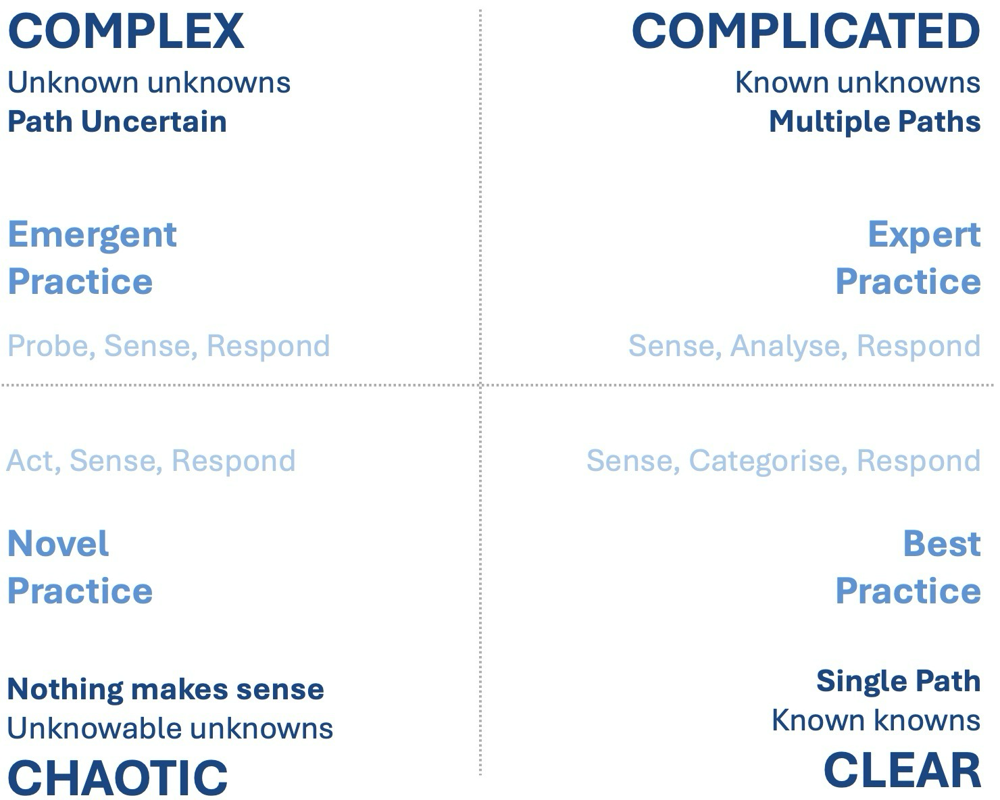

+++
title = 'Software Development: Engineering or Science?'
summary = "A look at why software development isn't engineering - it's a scientific journey through complexity. Explore how the Cynefin framework exposes why Agile thrives where Waterfall fails, why requirements shift like ecosystems, and why adaptability beats rigid blueprints. Learn why software isn't built - it's discovered."
tags = ['software development', 'Agile', 'Cynefin', 'complexity', 'Waterfall', 'engineering', 'scientific research']
categories = ['development']
keywords = [
  "software engineering vs scientific research",
  "Cynefin framework software development",
  "complicated vs complex Cynefin",
  "why software isn't engineering",
  "Agile methodology complexity",
  "Waterfall model failure",
  "software development unpredictability",
  "emergent practices in software",
  "software requirements ambiguity",
  "software dependencies chaos",
  "software adaptability over planning",
  "Agile vs Waterfall Cynefin",
  "software as scientific research",
  "complex systems in software",
  "software development human factors",
  "software engineering myth",
  "probe-sense-respond software"
]
date = 2025-01-28
draft = false
[cover]
    image = 'cover_image.webp'
    alt = 'Software Development: Engineering or Science?'
    caption = 'Software Development: Engineering or Science?'
    relative = true # when using page bundles set this to true
    hidden = false # only hide on current single page
    hiddenInSingle = false
+++

> _**tl;dr**_ Software development isn't engineering, it's a science! Right?

## Introduction

When we hear the term "software engineering", it conjures up images of meticulous specification documents, upfront planning, and predictable schedules. All hallmarks of traditional engineering disciplines like civil or mechanical engineering. But is software development really like building bridges or skyscrapers? Or does it belong to a different category altogether?

I've long been interested in the [Cynefin framework](https://en.wikipedia.org/wiki/Cynefin_framework) to help understand why software development often seems so "difficult". In this post, we'll look to Cynefin to understand why Waterfall methodologies were always doomed to fail, and see how Agile embraces the messy, iterative nature of creating software.

## Understanding Complexity with the Cynefin Framework

Developed by [Dave Snowden](https://en.wikipedia.org/wiki/Dave_Snowden), the [Cynefin framework](https://en.wikipedia.org/wiki/Cynefin_framework) categorises problems into four domains (shown in the diagram below): _Simple_, _Complicated_, _Complex_, and _Chaotic_. Actually, there is a fifth domain called _Disordered_. For the purposes of this discussion we're only interested in the **complicated** and **complex** domains:  

### Complicated

Problems here are solvable with expertise, analysis, and best practices. These problems have clear cause and effect relationships, and solutions are predictable with the right knowledge. They are best solved through structured processes and planning.

A familiar example is buying a house. If you consult the right experts, evaluate properties against your needs and budget, and follow the established processes for inspections and financing, you can predictably purchase a suitable home. The steps are understood, but they require analysis and expertise to navigate effectively.

Another example of a "complicated" problem is building a bridge. Engineers can calculate the forces, stresses, and materials needed to construct a bridge with a high degree of certainty. They can create detailed plans, blueprints, and schedules to ensure the project's success.

So a typical engineering project, like building a bridge, falls into the "complicated" domain. While it requires expertise and coordination, the problem itself is knowable and predictable.

### Complex

In this domain, cause and effect relationships are unclear until _after_ the fact. Solutions emerge through experimentation, adaptation, and learning. We must [_Inspect and Adapt_](https://scrumguides.org/scrum-guide.html) in Scrum speak or _Probe-Sense-Respond_ to use Cynefin language. The best way to navigate these problems is through iteration, feedback, and emergent strategies. They are inherently unpredictable and require a different approach than "complicated" problems.

Consider a [kids birthday party](https://www.youtube.com/watch?v=Miwb92eZaJg). We can (hopefully) intuitively understand that it would be futile to create a detailed "project plan", with milestones to track progress, for a kids party. Instead, all we can do is set some constraints and adapt as the party unfolds, adjusting activities based on the children's reactions, engagement, and energy levels. A kids party is a complex system.

I'm not suggesting that developers are like kids at a party 🤭, but a typical software project, falls into the "complex" domain. In this context, "complexity" doesn't refer to a tricky algorithm or how hard a problem is to solve. I mean, this could be a contributing factor perhaps. In this context, "complexity" refers to the _system_ as a whole. Requirements are often unclear, users' needs evolve, and technologies shift. In this domain, success doesn't come from exhaustive planning but from rapid experimentation, user feedback, and pivoting based on new information.

### Chaos and Clear

The Cynefin framework also includes _"clear"_ and _"chaotic"_ domains. _Clear_ problems have clear cause and effect relationships, where best practices are sufficient (e.g. following a recipe).

_Chaotic_ problems, on the other hand, require urgent, decisive action to regain control (e.g. responding to a system outage or natural disaster). While software development occasionally dips into chaos (e.g. firefighting production issues on a Friday evening), this isn't usually where we operate.

With this understanding of Cynefin, let's now look at why I believe software development should ditch the "engineering" label.

## Why Software Development is not "Engineering"

Building a bridge follows a linear path: requirements are fixed (e.g. span a river, support X weight), materials are well understood, and outcomes are predictable with sufficient expertise. Engineers rely on decades of physics, building regulations, standardised materials, and repeatable processes.  

Software projects, by contrast, are usually riddled with unknowns:  

- **Ambiguous Requirements**: Stakeholders often don't know what they want until they see a prototype.  
- **Evolving Tools**: Technologies and frameworks shift rapidly, rendering yesterday's "best practices" obsolete.  
- **Human Factors**: Software interacts with users, markets, and other systems in unpredictable ways.

Treating software like a bridge (i.e. assuming requirements are fixed and outcomes are plannable) is why [Waterfall](https://en.wikipedia.org/wiki/Waterfall_model) projects so often fail. Waterfall assumes a "complicated" problem, demanding exhaustive upfront design. But when requirements shift (and they always do), the plan disintegrates.  

### "But, building a bridge involves lots of people - why isn't it 'complex'?"

Large engineering projects do require coordination among hundreds maybe even thousands of people, from architects to welders. But the Cynefin framework distinguishes "complicated" from "complex" based on the nature of the problem, not team size.

Complicated systems are knowable. Bridges follow laws of physics that are well understood. While building one requires expertise, the relationships between cause and effect are predictable. Engineers can model stress points, calculate tolerances, and simulate outcomes before construction begins. The project is managed through hierarchies, schedules, and rigid processes.

Complex systems are unknowable upfront. Software projects often have many _unknown unknowns_ that are, erm, unknown at the outset. For example:

- How will users actually interact with this feature?
- Will this microservice architecture scale under unpredictable load?
- When will the third-party API be available?

These questions can't be fully answered with upfront analysis. Solutions emerge through trial and error, much like a biologist studying an ecosystem.

Building a bridge isn't complicated because it requires orchestrating many experts. It's "complicated" (as defined by Cynefin) because the problem itself (e.g. "span this river") is stable. The "complex" nature of software development isn't about the number of people involved. It's about the unpredictability of the system itself. Bridges operate in a closed, deterministic world; software exists in an open, adaptive one.

Two teams giving the same plans will build the same bridge. Two teams given the same software requirements will produce wildly different products. This is the essence of complexity.

### "We've been building software for decades - why is it still 'complex'?"

Fields like civil engineering have matured over centuries, developing standardised practices, materials, and formulas. But software's persistent complexity stems from its fundamental nature.

Unlike physical structures, software exists in a realm of logic and human intent. Requirements shift as stakeholders discover new needs, markets evolve, or competitors innovate. As I mentioned above, a bridge's purpose (span a river) is static; software's purpose (solve a problem, delight users) is dynamic.

A bridge's load bearing calculations rely on well understood physics. Software, however, interacts with layers of dependencies (APIs, libraries, user behavior, hardware) that create emergent behaviors.

Software is shaped by people, developers, users, and stakeholders whose behaviors, preferences, and misunderstandings introduce variability. Even decades of experience can't eliminate the unpredictability of human interaction.

> _**"You ship what is in your programmers' brains"**_ - Andrea Magnorsky

I recently attended [YOW! Brisbane](https://yowcon.com/brisbane-2024) and learned a great quote by [Andrea Magnorsky](https://yowcon.com/brisbane-2024/speakers/3602/andrea-magnorsky) which I think is very relevant here: _"You ship what is in your programmers' brains"_. It speaks to the difficulty of sharing information between team members and the inherent unpredictability of human factors in software development.

Civil engineering's core principles (e.g. Newtonian physics) haven't changed in centuries. Software tools, frameworks, and paradigms, however, evolve at rapid speed. Whilst we often refer to "best practices" in software development, these are often fleeting, context dependent, and subject to change.

So then. "Complexity" isn't a _bug_ of modern software development projects, it's an inherent _feature_ of it.

## Agile and Embracing Complexity

Agile methodologies succeed by acknowledging complexity. Instead of rigid plans, Agile embraces:  

- **Iterative Development**: Deliver small, functional increments to gather user feedback.  
- **Adaptive Planning**: Prioritise flexibility over exhaustive upfront plans and documentation.  
- **Empirical Process Control**: Learn by doing, adjusting course as new information emerges.  

This mirrors how scientists work: forming hypotheses, running experiments, and refining theories based on evidence. A startup pivoting after user testing or a team refactoring code based on new insights aren't "engineering", they're conducting research.  

Scientific research thrives on uncertainty. A biologist doesn't know what they'll find when studying a new species; they adapt their methods based on emerging data. Similarly, developers can't foresee how users will interact with a feature until it's deployed. Agile's iterative, adaptive approach mirrors the scientific method more than traditional engineering.

The scientific method isn't haphazard; it's a structured way to navigate uncertainty. Agile software development, likewise, isn't a free for all; it's a disciplined approach to exploring the unknown.

## Conclusion

Calling software development "engineering" risks imposing the wrong mindset. Unlike bridges, software isn't built; it _emerges_ and _grows_ through exploration, adaptation, and continuous learning. The Cynefin framework helps us see why. In complex domains, success does not come from executing meticulous upfront plans but from iterative discovery.  

A bridge stands unchanged for decades; software is never done, it adapts or becomes obsolete.

Perhaps it's time to retire the term "software engineering" altogether. The next groundbreaking app that users love won't emerge from a blueprint and won't come from following a detailed project plan. It'll be discovered through iteration, creativity, and the courage to embrace complexity.  

How do you approach software development, as an engineer or a scientist? Comment below!

Thanks for reading.
